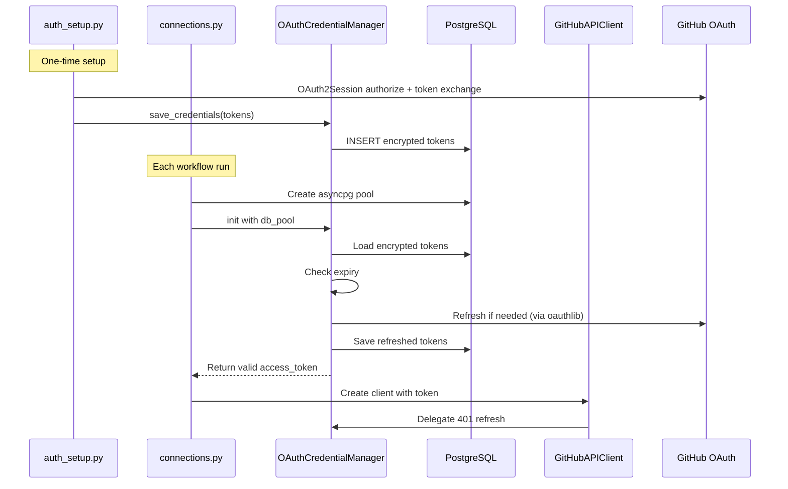

# OAuth Credential Management Refactor

## Current State

Today, GitHub OAuth tokens live **only in environment variables and in-memory**:

- [`workflows/connections.py`](workflows/connections.py) reads `GITHUB_ACCESS_TOKEN`, `GITHUB_REFRESH_TOKEN`, `GITHUB_CLIENT_ID`, `GITHUB_CLIENT_SECRET` from env vars and passes them to `GitHubAPIClient`.
- [`workflows/github_api.py`](workflows/github_api.py) has its own `_refresh_oauth_token()` method that refreshes inline with raw HTTP calls. Refreshed tokens are held in memory only -- **lost between workflow runs**.
- [`workflows/lib/oauth_manager.py`](workflows/lib/oauth_manager.py) and [`workflows/lib/encryption.py`](workflows/lib/encryption.py) were designed for DB-backed encrypted token storage but are **dead code** -- never imported anywhere, and `cryptography` is not in `requirements.txt`.
- There is no `github_oauth_credentials` table in the database schema.

## Proposed Architecture



## Key Changes

### 1. Add `github_oauth_credentials` table

Create [`database/schema/06_oauth_credentials.sql`](database/schema/06_oauth_credentials.sql) and add it to [`database/init.sql`](database/init.sql).

```sql
CREATE TABLE IF NOT EXISTS github_oauth_credentials (
    id INTEGER PRIMARY KEY DEFAULT 1,
    access_token_encrypted TEXT NOT NULL,
    refresh_token_encrypted TEXT NOT NULL,
    token_expires_at TIMESTAMPTZ NOT NULL,
    refresh_token_expires_at TIMESTAMPTZ NOT NULL,
    created_at TIMESTAMPTZ DEFAULT NOW(),
    updated_at TIMESTAMPTZ DEFAULT NOW(),
    CONSTRAINT single_row CHECK (id = 1)
);
```

Single-row design (enforced by `CHECK (id = 1)`) since this app has one GitHub identity.

### 2. Add `oauthlib` and `cryptography` dependencies

Update [`workflows/requirements.txt`](workflows/requirements.txt):

- `oauthlib>=3.2.0` -- core OAuth2 protocol logic (token parsing, refresh request construction)
- `requests-oauthlib>=1.3.0` -- used by `auth_setup.py` for the sync browser-based authorization flow
- `cryptography>=42.0.0` -- already used by `encryption.py` but missing from requirements

`oauthlib` handles the OAuth2 protocol correctly (token expiry, refresh grant construction, response parsing) while `aiohttp` remains the async HTTP transport for the workflow runtime.

### 3. Refactor `OAuthCredentialManager`

Update [`workflows/lib/oauth_manager.py`](workflows/lib/oauth_manager.py) to use `oauthlib.oauth2.WebApplicationClient` for:

- Constructing token refresh requests (`prepare_refresh_token_request()`)
- Parsing token responses (`parse_request_body_response()`)
- Tracking token expiry state

Keep the existing encrypted DB storage pattern (it was well-designed, just never wired in). The manager will:

1. Load encrypted tokens from DB on init
2. Use `oauthlib` to check expiry and build refresh requests
3. Use `aiohttp` to send the refresh request
4. Parse the response through `oauthlib`
5. Encrypt and persist new tokens back to DB

### 4. Wire `OAuthCredentialManager` into the workflow

Update [`workflows/connections.py`](workflows/connections.py) `init_connections()`:

- Create `db_pool` **first** (already uses `DATABASE_URL`)
- If the token looks like an OAuth token (`ghu_`), create `OAuthCredentialManager(db_pool)` and load/refresh credentials from the DB
- Fall back to env var tokens for initial seed or PAT usage
- Pass the valid token to `GitHubAPIClient`

### 5. Simplify `GitHubAPIClient` token refresh

Update [`workflows/github_api.py`](workflows/github_api.py):

- Remove the inline `_refresh_oauth_token()` method
- Accept an optional `OAuthCredentialManager` reference
- On 401 errors, delegate to the manager's `handle_401_error()` instead of doing its own refresh
- This eliminates the duplicated refresh logic

### 6. Update `auth_setup.py` for DB seeding

Update [`workflows/auth_setup.py`](workflows/auth_setup.py):

- Use `requests_oauthlib.OAuth2Session` for the authorization code flow (cleaner than raw `requests.post`)
- After obtaining tokens, save them to the DB via `OAuthCredentialManager.save_credentials()` (in addition to printing env var instructions)
- This seeds the initial tokens that the workflow will then manage automatically

### 7. Update `render.yaml` with new env var

Add `GITHUB_TOKEN_ENCRYPTION_KEY` to the workflow service in [`render.yaml`](render.yaml):

```yaml
- key: GITHUB_TOKEN_ENCRYPTION_KEY
  sync: false
```

This is a one-time setup: generate the key locally, paste it into the Render dashboard once.

### Env Var Changes

| Env Var | Action | Notes |

|---------|--------|-------|

| `DATABASE_URL` | No change | Already exists |

| `GITHUB_CLIENT_ID` | No change | Already set, does not rotate |

| `GITHUB_CLIENT_SECRET` | No change | Already set, does not rotate |

| `GITHUB_TOKEN_ENCRYPTION_KEY` | **Add once** | New. Generate with `python -c "from cryptography.fernet import Fernet; print(Fernet.generate_key().decode())"`, set in Render dashboard once, never changes |

| `GITHUB_ACCESS_TOKEN` | Keep for now | Used as initial DB seed on first run. Can be removed from Render dashboard after first successful workflow run |

| `GITHUB_REFRESH_TOKEN` | Keep for now | Used as initial DB seed on first run. Can be removed from Render dashboard after first successful workflow run |

### Automatic Token Rotation -- Zero Manual Process

After the one-time setup (adding `GITHUB_TOKEN_ENCRYPTION_KEY` to Render):

1. **First workflow run**: No tokens in DB yet. System falls back to `GITHUB_ACCESS_TOKEN` / `GITHUB_REFRESH_TOKEN` env vars, uses them to seed the DB, then proceeds normally.
2. **Every subsequent run**: `OAuthCredentialManager` loads tokens from DB, checks expiry (via `oauthlib`), refreshes if needed, persists new tokens back to DB. Env vars are ignored.
3. **Self-sustaining chain**: Each GitHub refresh returns a new access token (8h) AND a new refresh token (6 months). As long as the workflow runs at least once every 6 months (the cron runs daily), the chain never breaks.
4. **Mid-run refresh**: If a token expires mid-run, `GitHubAPIClient` delegates the 401 to `OAuthCredentialManager`, which refreshes + persists and retries -- all automatic.

**You never need to touch the Render dashboard for token updates again.**

### Backward Compatibility