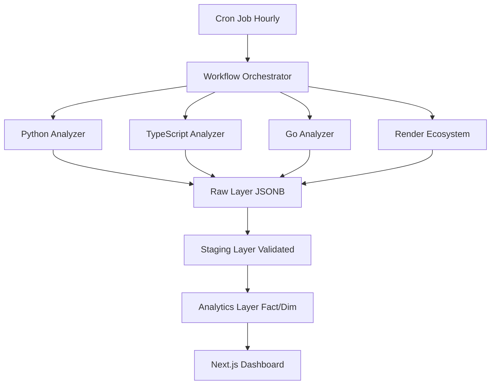

# Trender: GitHub Trending Analytics Platform

A batch analytics platform with a **3-layer data engineering pipeline** (Raw → Staging → Analytics) that analyzes trending GitHub repositories across 3 programming languages (Python, TypeScript with Next.js >= 16, and Go). Leverages Render Workflows' distributed task execution to process data in parallel, storing results in a dimensional model for high-performance analytics.

## Key Features

- **Multi-Language Analysis**: Tracks Python, TypeScript/Next.js, and Go repositories
- **3-Layer Data Pipeline**: Raw ingestion → Staging validation → Analytics dimensional model
- **Parallel Processing**: 4 concurrent workflow tasks using Render Workflows SDK
- **Render Ecosystem Spotlight**: Dedicated showcase for Render-deployed projects
- **Real-time Dashboard**: Next.js 14 dashboard with analytics visualizations
- **Hourly Updates**: Automated cron job triggers workflow execution

## Architecture



## Tech Stack

**Backend (Workflows)**
- Python 3.11+
- Render Workflows SDK with `@task` decorators
- asyncpg for PostgreSQL
- aiohttp for async API calls
- GitHub REST API

**Frontend (Dashboard)**
- Next.js 14 (App Router)
- TypeScript
- Tailwind CSS
- Recharts for visualizations
- PostgreSQL (pg)

**Infrastructure**
- Render Workflows (task execution)
- Render Cron Job (hourly trigger)
- Render Web Service (Next.js dashboard)
- Render PostgreSQL (data storage)

## Project Structure

```
trender/
├── workflows/
│   ├── workflow.py           # Main workflow with @task decorators
│   ├── github_api.py         # Async GitHub API client
│   ├── connections.py        # Shared resource management
│   ├── metrics.py            # Momentum/activity calculations
│   ├── render_detection.py  # Render usage detection
│   ├── etl/
│   │   ├── extract.py        # Raw layer extraction
│   │   ├── transform.py      # Staging transformations
│   │   ├── load.py           # Analytics layer loading
│   │   └── data_quality.py   # Quality scoring
│   └── requirements.txt
├── trigger/
│   ├── trigger.py            # Cron trigger script
│   └── requirements.txt
├── dashboard/
│   ├── app/                  # Next.js App Router pages
│   ├── lib/
│   │   └── db.ts            # Database utilities
│   └── package.json
├── database/
│   ├── schema/
│   │   ├── 01_raw_layer.sql
│   │   ├── 02_staging_layer.sql
│   │   ├── 03_analytics_layer.sql
│   │   └── 04_views.sql
│   └── init.sql
├── render.yaml
├── .env.example
└── README.md
```

## Setup Instructions

### Prerequisites

- GitHub App with client ID and client secret
- Render account
- Node.js 18+ (for dashboard)
- Python 3.11+ (for workflows)

### 1. Clone Repository

```bash
git clone <your-repo-url>
cd trender
```

### 2. Set Up Environment Variables

```bash
cp .env.example .env
# Edit .env with your credentials
```

Required variables:
- `GITHUB_CLIENT_ID`: Your GitHub App client ID
- `GITHUB_CLIENT_SECRET`: Your GitHub App client secret
- `DATABASE_URL`: PostgreSQL connection string
- `RENDER_WORKFLOW_ID`: Workflow ID (after deployment)
- `RENDER_API_KEY`: Render API key

### 3. Create PostgreSQL Database on Render

1. Go to Render Dashboard
2. Create new PostgreSQL database named `trender`
3. Note the connection string for `DATABASE_URL`

### 4. Initialize Database Schema

#### Option 1: Using the init.sql script (Recommended)

```bash
# Connect to your Render PostgreSQL instance and run the initialization script

DATABASE_URL=YOUR_DATABASE_URL
psql $DATABASE_URL -f database/init.sql
```

#### Option 2: Run schema files individually

If you prefer to run the schema files one at a time:

```bash
# Run each schema file in order
psql $DATABASE_URL -f database/schema/01_raw_layer.sql
psql $DATABASE_URL -f database/schema/02_staging_layer.sql
psql $DATABASE_URL -f database/schema/03_analytics_layer.sql
psql $DATABASE_URL -f database/schema/04_views.sql
```

#### What gets created:

**Raw Layer:**
- `raw_github_repos`: Stores complete GitHub API responses
- `raw_repo_metrics`: Stores repository metrics (stars, forks, issues)

**Staging Layer:**
- `stg_repos_validated`: Cleaned and validated repository data
- `stg_render_enrichment`: Render-specific metadata and detection

**Analytics Layer:**
- Dimension tables: `dim_repositories`, `dim_languages`, `dim_render_services`
- Fact tables: `fact_repo_snapshots`, `fact_render_usage`, `fact_workflow_executions`

**Views:**
- Pre-aggregated analytics views for dashboard queries

#### Verify Database Initialization

Check that all tables were created successfully:

```bash
psql $DATABASE_URL -c "\dt"
```

You should see 12+ tables across the raw, stg, dim, and fact prefixes.

#### Troubleshooting

- **Connection refused**: Ensure your `DATABASE_URL` is correct and the Render PostgreSQL instance is active
- **Permission denied**: Make sure you're using the connection string with full admin privileges
- **Tables already exist**: Drop the database and recreate it, or use `DROP TABLE IF EXISTS` statements

### 5. Deploy Render Workflows

```bash
# Install Render Workflows SDK
pip install render-sdk

# Deploy workflow
cd workflows
render-workflows deploy workflow.py

# Note the WORKFLOW_ID from the output
```

Set environment variables in Render Workflows dashboard:
- `GITHUB_CLIENT_ID`
- `GITHUB_CLIENT_SECRET`
- `DATABASE_URL`

### 6. Deploy Services via render.yaml

The `render.yaml` file defines:
- **Web Service**: Next.js dashboard
- **Cron Job**: Hourly workflow trigger
- **Database**: PostgreSQL instance

Deploy to Render:
```bash
# Push to GitHub and connect to Render
# Or use Render Blueprint button
```

### 7. Configure Cron Job

After deploying, update the cron job environment variables:
- `RENDER_WORKFLOW_ID`: Your workflow ID from step 5
- `RENDER_API_KEY`: Your Render API key

### 8. Trigger First Workflow Run

```bash
# Manual trigger via Render Workflows CLI
render-workflows trigger <WORKFLOW_ID>

# Or trigger via API
cd trigger
python trigger.py
```

### 9. Access Dashboard

Once the workflow completes, access your dashboard at:
```
https://trender-dashboard.onrender.com
```

## Data Pipeline Layers

### Layer 1: Raw Ingestion
- Stores complete GitHub API responses
- Tables: `raw_github_repos`, `raw_repo_metrics`
- Purpose: Audit trail and reprocessing capability

### Layer 2: Staging (Validation)
- Cleaned and validated data
- Tables: `stg_repos_validated`, `stg_render_enrichment`
- Data quality scoring (0.0 - 1.0)
- Business rules applied

### Layer 3: Analytics (Dimensional Model)
- **Dimensions**: `dim_repositories`, `dim_languages`, `dim_render_services`
- **Facts**: `fact_repo_snapshots`, `fact_render_usage`, `fact_workflow_executions`
- **Views**: Pre-aggregated analytics for dashboard

## Workflow Tasks

The workflow consists of 8 tasks decorated with `@task`:

1. **`main_analysis_task`**: Orchestrator that spawns parallel tasks
2. **`fetch_language_repos`**: Fetches repos for Python, TypeScript, Go
3. **`analyze_repo_batch`**: Analyzes repos in batches of 10
4. **`fetch_render_ecosystem`**: Fetches Render-related projects
5. **`analyze_render_projects`**: Analyzes Render-specific features
6. **`aggregate_results`**: ETL pipeline execution (Extract → Transform → Load)
7. **`store_execution_stats`**: Records workflow performance metrics

## Metrics Calculated

- **Star Velocity**: `(stars_last_7_days / total_stars) * 100`
- **Activity Score**: Weighted formula using commits, issues, contributors
- **Momentum Score**: `(star_velocity * 0.4) + (activity_score * 0.6)`
- **Render Boost**: 1.2x multiplier for projects using Render
- **Freshness Penalty**: 0.9x for repos older than 180 days

## Development

### Local Development - Workflows

```bash
cd workflows
pip install -r requirements.txt
python workflow.py
```

### Local Development - Dashboard

```bash
cd dashboard
npm install
npm run dev
# Access at http://localhost:3000
```

### Run Database Migrations

```bash
psql $DATABASE_URL -f database/schema/01_raw_layer.sql
psql $DATABASE_URL -f database/schema/02_staging_layer.sql
psql $DATABASE_URL -f database/schema/03_analytics_layer.sql
psql $DATABASE_URL -f database/schema/04_views.sql
```

## Success Metrics

**Technical:**
- Process 300+ repos across 3 languages in under 10 seconds
- 3x speedup vs sequential processing
- 99%+ success rate on workflow runs
- Data quality score >= 0.90 for 95%+ repositories

**Marketing:**
- Showcase 50+ Render ecosystem projects
- Track Render adoption vs competitors
- Identify case study candidates

## License

MIT

## Contributing

Contributions welcome! Please open an issue or submit a pull request.
