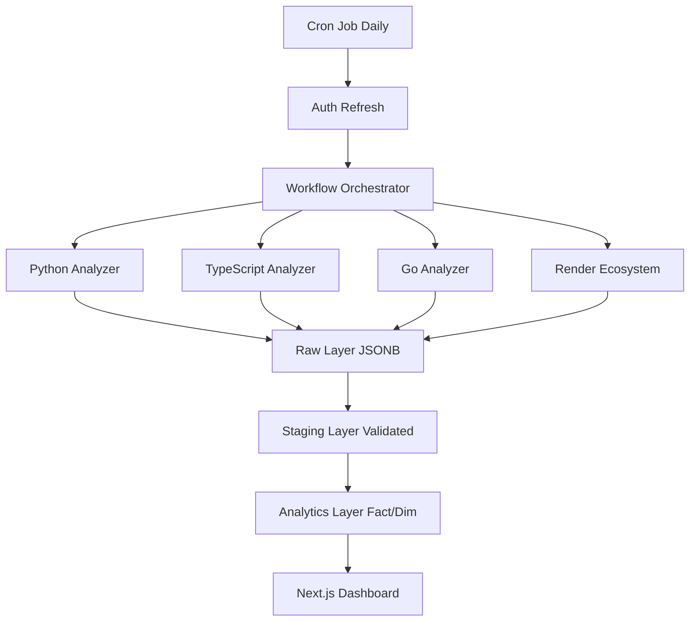

# [trender.onrender.com](https://trender.onrender.com/)

A distributed analytics platform that tracks trending GitHub repositories across Python, TypeScript/Next.js, Go, and the Render ecosystem. Uses Render Workflows for parallel processing and a 3-layer data pipeline (Raw → Staging → Analytics) for high-performance analytics.

## Demo

https://github.com/user-attachments/assets/ba79db68-fc73-4508-9d90-0f4abcf050a7

## 🎯 Quick start

```bash
# 1. Clone and setup
git clone https://github.com/render-examples/trender.git
cd trender
cp .env.example .env

# 2. Setup GitHub OAuth authentication
cd workflows
pip install -r requirements.txt
python auth_setup.py  # Guides through OAuth app setup, saves encrypted credentials to DB

# 3. Create Render PostgreSQL database
# Visit dashboard.render.com → New PostgreSQL
# Add DATABASE_URL to .env

# 4. Initialize database
./bin/db_setup.sh

# 5. Deploy to Render
# Push to GitHub, then: Dashboard → New Blueprint → Connect repo

# 6. Create Render API key
# Visit dashboard.render.com → Account Settings → API Keys → Create API Key

# 7. Trigger first run (refreshes auth, then triggers workflow)
cd trigger
pip install -r requirements.txt
export RENDER_API_KEY=<your_key>
export RENDER_WORKFLOW_SLUG=trender-wf
python trigger.py
```

## 🏗️ Architecture


```mermaid
graph TD
    A[Cron Job Daily] --> B[Auth Refresh]
    B --> C[Workflow Orchestrator]
    C --> D[Python Analyzer]
    C --> E[TypeScript Analyzer]
    C --> F[Go Analyzer]
    C --> G[Render Ecosystem]
    D --> H[Raw Layer JSONB]
    E --> H
    F --> H
    G --> H
    H --> I[Staging Layer Validated]
    I --> J[Analytics Layer Fact/Dim]
    J --> K[Next.js Dashboard]
```

**Data pipeline:**
- **Raw layer**: Complete GitHub API responses (JSONB) - 7 day retention
- **Staging layer**: Validated & cleaned data with business rules - 7 day retention
- **Analytics layer**: Dimensional model (facts + dimensions) - 30 day retention

**Processing:**
- 4 parallel workflow tasks (Python, TypeScript, Go, Render)
- ~150 repos analyzed per run
- Automated daily updates via cron

## 📁 Project structure

```
trender/
├── workflows/          # Python workflows (ETL pipeline)
├── dashboard/          # Next.js dashboard (UI)
├── database/           # PostgreSQL schemas & migrations
├── trigger/            # Daily auth refresh + cron trigger
├── bin/               # Utility scripts
├── render-mcp-server/ # MCP server for Render API
└── render.yaml        # Render service configuration
```

See individual README files in each directory for details.

## 🔧 Tech stack

**Backend:**
- Python 3.11+ with Render Workflows SDK
- asyncpg for PostgreSQL
- aiohttp for async GitHub API calls

**Frontend:**
- Next.js 14.2 (App Router)
- TypeScript, Tailwind CSS
- Recharts for visualizations

**Infrastructure:**
- Render Workflows (distributed task execution)
- Render Cron Job (daily trigger)
- Render Web Service (dashboard)
- Render PostgreSQL (data storage)

## 📊 Key features

- **Multi-language analysis**: Python, TypeScript, Go, and Render ecosystem
- **Parallel processing**: 4 concurrent tasks using Workflows SDK
- **Momentum scoring**: 70% recency + 30% stars to surface emerging projects
- **Automated retention**: Tiered cleanup (7/7/30 days) to control storage costs
- **Real-time dashboard**: Live analytics with historical trends

## 🚀 Development

### Local workflow testing

```bash
# Runs auth refresh + workflow server + trigger in one command
python bin/local_dev.py
```

### Local dashboard

```bash
cd dashboard
npm install
npm run dev
# Visit http://localhost:3000
```

## 📖 Documentation

- **[Setup Guide](database/schema/)** - Database initialization details
- **[Workflows README](workflows/README.md)** - ETL pipeline & task orchestration
- **[Dashboard README](dashboard/README.md)** - Frontend architecture
- **[Database README](database/README.md)** - Schema & data model
- **[Bin Scripts](bin/README.md)** - Utility scripts reference

## 🔐 Authentication

Trender uses GitHub OAuth App tokens, stored encrypted in PostgreSQL. Tokens are never stored in environment variables after initial setup.

**One-time setup:**
1. Create an OAuth app at github.com/settings/developers
2. Add `GITHUB_CLIENT_ID` and `GITHUB_CLIENT_SECRET` to `.env`
3. Run `python workflows/auth_setup.py` — generates an encryption key, authorizes via browser, saves encrypted credentials to DB

**Daily refresh:**
- `trigger/refresh_auth.py` runs once daily before the workflow, consuming the refresh token exactly once
- GitHub's single-use refresh tokens are never used anywhere else, eliminating race conditions across parallel workflow tasks
- New credentials are written back to the database; the access token lasts 8 hours (well within the daily cycle)

**Required environment variables:**
```bash
# Workflow service (trender-wf) and cron job (trender-cron)
GITHUB_CLIENT_ID=<oauth-app-client-id>
GITHUB_CLIENT_SECRET=<oauth-app-client-secret>
GITHUB_TOKEN_ENCRYPTION_KEY=<generated by auth_setup.py>
DATABASE_URL=<postgresql-connection-string>

# Cron job only (trender-cron) — also needs:
RENDER_API_KEY=<render-api-key>
RENDER_WORKFLOW_SLUG=trender-wf
```

## 🎯 Metrics and scoring

**Momentum score formula:**
- 70% Recency (exponential decay favoring repos ≤14 days old)
- 30% Normalized stars (separate normalization for general vs Render repos)

**Render detection:**
- Code search for `render.yaml` in repository root
- Repositories assigned `language='render'` for clean identification
- Enrichment table tracks processing status (no classification logic)

## 🗄️ Data retention

Automatic cleanup after each workflow run:

| Layer | Retention | Purpose |
|-------|-----------|---------|
| Raw | 7 days | Debugging & reprocessing |
| Staging | 7 days | ETL audit trail |
| Analytics | 30 days | Dashboard trending data |

Manual cleanup: `./bin/cleanup_data.sh`

## 📦 Deployment

The `render.yaml` defines all services:
- **trender-dashboard**: Next.js web service
- **trender-wf**: Workflow orchestrator
- **trender-cron**: Daily trigger + auth refresh (6 AM PST / 14:00 UTC)
- **trender-db**: PostgreSQL database

Deploy via Render Dashboard (Blueprint) or CLI:
```bash
render blueprint launch
```

**Post-deployment:**
1. Run `python workflows/auth_setup.py` locally to initialize credentials in the database
2. Add `GITHUB_CLIENT_ID`, `GITHUB_CLIENT_SECRET`, `GITHUB_TOKEN_ENCRYPTION_KEY` to both `trender-wf` and `trender-cron` in the Render Dashboard
3. Trigger a manual cron run to verify auth refresh works end-to-end

## 📄 License

MIT

## 🤝 Contributing

Contributions welcome! Please open an issue or submit a pull request.
