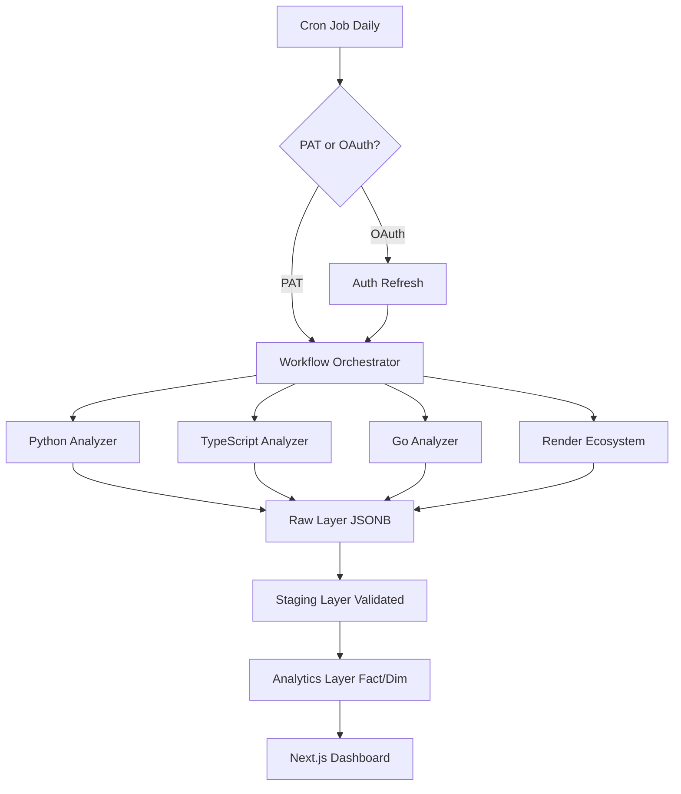

# [trender.onrender.com](https://trender.onrender.com/)

[Trender](https://trender.onrender.com/) is a distributed analytics platform that tracks trending GitHub repositories across Python, TypeScript/Next.js, Go, and the Render ecosystem. Uses Render Workflows for parallel processing and a 3-layer data pipeline (Raw → Staging → Analytics) for high-performance analytics.

[](https://render.com/deploy?repo=https://github.com/render-examples/trender)

## Demo


https://github.com/user-attachments/assets/19875fe8-4a75-4a97-9ecf-4549cea292ec


## 🎯 Quick start

```bash
# 1. Clone and setup
git clone https://github.com/render-examples/trender.git
cd trender
cp env.example .env

# 2. Setup GitHub authentication (PAT is the simplest path)
#    Option A — PAT: create at https://github.com/settings/tokens/new (scopes: repo, read:org)
#                    add GITHUB_PAT=ghp_... to .env
#    Option B — OAuth: run the interactive setup script
cd workflows
pip install -r requirements.txt
python auth_setup.py  # Guides through PAT / OAuth app setup

# 3. Create Render PostgreSQL database
# Visit dashboard.render.com → New PostgreSQL
# Add external DATABASE_URL to .env

# 4. Initialize database
./bin/db_setup.sh

# 5. Deploy to Render
# Push to GitHub, then: Dashboard → New Blueprint → Connect repo

# 6. Create Render API key
# Visit dashboard.render.com → Account Settings → API Keys → Create API Key

# 7. Trigger first run (refreshes auth, then triggers workflow)
cd trigger
pip install -r requirements.txt
export RENDER_API_KEY=<your_key>
export RENDER_WORKFLOW_SLUG=trender-wf
python trigger.py
```

## 🏗️ Architecture


```mermaid
graph TD
    A[Cron Job Daily] --> B{PAT or OAuth?}
    B -->|OAuth| C[Auth Refresh]
    B -->|PAT| D[Workflow Orchestrator]
    C --> D
    D --> E[Python Analyzer]
    D --> F[TypeScript Analyzer]
    D --> G[Go Analyzer]
    D --> H[Render Ecosystem]
    E --> I[Raw Layer JSONB]
    F --> I
    G --> I
    H --> I
    I --> J[Staging Layer Validated]
    J --> K[Analytics Layer Fact/Dim]
    K --> L[Next.js Dashboard]
```

**Data pipeline:**
- **Raw layer**: Complete GitHub API responses (JSONB) - 7 day retention
- **Staging layer**: Validated & cleaned data with business rules - 7 day retention
- **Analytics layer**: Dimensional model (facts + dimensions) - 30 day retention

Manual cleanup: `./bin/cleanup_data.sh`

**Processing:**
- 4 parallel workflow tasks (Python, TypeScript, Go, Render)
- ~100 repos analyzed per run (25 per task)
- Automated daily updates via cron

## 📁 Project structure

```
trender/
├── workflows/          # Python workflows (ETL pipeline)
├── dashboard/          # Next.js dashboard (UI)
├── database/           # PostgreSQL schemas & migrations
├── trigger/            # Daily auth refresh + cron trigger
├── bin/               # Utility scripts
├── render-mcp-server/ # MCP server for Render API
└── render.yaml        # Render service configuration
```

See individual README files in subdirectories for details.

## 🔧 Tech stack

**Backend:**
- Python 3.11+ with Render Workflows SDK
- asyncpg for PostgreSQL
- aiohttp for async GitHub API calls

**Frontend:**
- Next.js 14.2 (App Router)
- TypeScript, Tailwind CSS
- Recharts for visualizations

**Infrastructure:**
- Render Workflows (distributed task execution)
- Render Cron Job (daily trigger)
- Render Web Service (dashboard)
- Render PostgreSQL (data storage)

## 📊 Key features

- **Multi-language analysis**: Python, TypeScript, Go, and Render ecosystem
- **Parallel processing**: 4 concurrent tasks using Workflows SDK (~100 repos/run)
- **Momentum scoring**: 70% recency + 30% stars to surface emerging projects
- **Automated retention**: Tiered cleanup (7/7/30 days) to control storage costs
- **Real-time dashboard**: Live analytics with historical trends

## 🚀 Development

### Local workflow testing

```bash
# Runs auth refresh + workflow server + trigger in one command
python bin/local_dev.py
```

### Local dashboard

```bash
cd dashboard
npm install
npm run dev
# Visit http://localhost:3000
```

## 📖 Documentation

- **[Setup guide](database/schema/)** - Database initialization details
- **[Workflows README](workflows/README.md)** - ETL pipeline & task orchestration
- **[Trigger README](trigger/README.md)** - Workflow triggers & authentication
- **[Dashboard README](dashboard/README.md)** - Frontend architecture
- **[Database README](database/README.md)** - Schema & data model
- **[Bin scripts](bin/README.md)** - Utility scripts reference

## 🔐 Authentication

Trender supports two GitHub authentication methods. Choose one:

**Option 1 — Personal Access Token (PAT)** *(recommended)*
1. Create a PAT at github.com/settings/tokens/new (scopes: `repo`, `read:org`)
2. Add `GITHUB_PAT=ghp_...` to `.env`

No encryption key, no DB credentials table, no daily refresh needed.

**Option 2 — OAuth App**
1. Create an OAuth app at github.com/settings/developers (callback: `http://localhost:8000/callback`)
2. Add `GITHUB_CLIENT_ID` and `GITHUB_CLIENT_SECRET` to `.env`
3. Run `python workflows/auth_setup.py` — authorizes via browser, generates encryption key, saves encrypted credentials to DB

The daily cron job runs `refresh_auth.py` to rotate tokens before each workflow run. GitHub's single-use refresh tokens are consumed exactly once per day, eliminating race conditions across parallel workflow tasks.

**Environment variables by auth method:**

| Variable | PAT | OAuth |
|----------|-----|-------|
| `GITHUB_PAT` | ✅ required | — |
| `GITHUB_CLIENT_ID` | — | ✅ required |
| `GITHUB_CLIENT_SECRET` | — | ✅ required |
| `GITHUB_TOKEN_ENCRYPTION_KEY` | — | ✅ required |
| `DATABASE_URL` | ✅ required (workflow) | ✅ required |
| `RENDER_API_KEY` | ✅ required | ✅ required |
| `RENDER_WORKFLOW_SLUG` | ✅ required | ✅ required |

## 🎯 Metrics and scoring

**Momentum score formula:**
- 70% recency (exponential decay favoring repos ≤14 days old)
- 30% normalized stars (separate normalization for general vs Render repos)

**Render detection:**
- Code search for `render.yaml` in repository root
- Repositories assigned `language='render'` for clean identification

## 📦 Deployment

The `render.yaml` defines all services:
- **trender-dashboard**: Next.js web service
- **trender-wf**: Workflow orchestrator
- **trender-cron**: Daily trigger + auth refresh (6 AM PST / 14:00 UTC)
- **trender-db**: PostgreSQL database

Deploy via Render Dashboard (Blueprint) or CLI:
```bash
render blueprint launch
```

**Post-deployment:**

*PAT path:*
1. Add `GITHUB_PAT`, `DATABASE_URL`, `RENDER_API_KEY`, and `RENDER_WORKFLOW_SLUG` to both `trender-wf` and `trender-cron` in the Render dashboard
2. Trigger a manual cron run to verify the workflow runs end-to-end

*OAuth path:*
1. Run `python workflows/auth_setup.py` locally to initialize credentials in the database
2. Add `GITHUB_CLIENT_ID`, `GITHUB_CLIENT_SECRET`, `GITHUB_TOKEN_ENCRYPTION_KEY`, `DATABASE_URL`, `RENDER_API_KEY`, and `RENDER_WORKFLOW_SLUG` to both `trender-wf` and `trender-cron` in the Render dashboard
3. Trigger a manual cron run to verify auth refresh works end-to-end

## 📄 License

MIT

## 🤝 Contributing

Contributions welcome! Please open an issue or submit a pull request.
