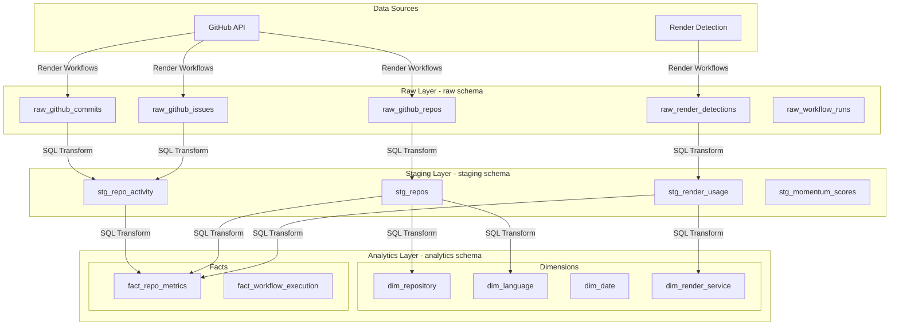
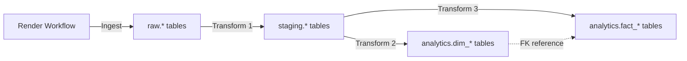

# Trender Data Engineering Architecture

## Executive Summary

Trender uses a modern data engineering architecture with three distinct layers: **Raw**, **Staging**, and **Analytics**. This layered approach follows industry best practices for data warehousing, providing data quality, auditability, and optimized query performance.

**Key Features**:
- **Layered Architecture**: Separation of ingestion, transformation, and analytics
- **Star Schema**: Optimized dimensional model for fast dashboard queries
- **SCD Type 2**: Full historical tracking with slowly changing dimensions
- **Data Lineage**: Every record traces back to source API call
- **Audit Trail**: Comprehensive tracking of data flow and transformations

## Architecture Overview



## Data Flow

### End-to-End Process

1. **Ingestion** (Render Workflows → Raw Layer):
   - Python workflows call GitHub API
   - Store unmodified responses in `raw.*` tables
   - Add audit metadata: `_ingested_at`, `_execution_id`, `_source`

2. **Transformation** (Raw → Staging):
   - SQL scripts clean and validate data
   - Apply business rules (e.g., stars >= 0)
   - Calculate derived metrics (star velocity, activity scores)
   - Deduplicate to latest record per execution

3. **Analytics** (Staging → Analytics):
   - Load dimension tables (with SCD Type 2 for history)
   - Insert fact table records
   - Update historical records (`valid_to`, `is_current`)
   - Apply star schema relationships

4. **Consumption** (Dashboard Queries):
   - Join facts with dimensions
   - Filter on `is_current = true` for latest data
   - Leverage indexes for fast queries

### Data Freshness

- **Ingestion**: Hourly via cron trigger
- **Transformation**: Runs immediately after ingestion completes
- **Dashboard**: Queries always show latest transformed data
- **Latency**: End-to-end ~15 minutes (12s ingestion + 2-3min transformation)

## Layer 1: Raw Layer (`raw` schema)

### Purpose

Store **unmodified** data from source systems with complete audit trail. This layer serves as:
- Immutable source of truth
- Enables reprocessing without re-fetching APIs
- Audit and compliance trail
- Debugging and data quality investigations

### Design Principles

1. **No Transformations**: Store exactly what API returns
2. **Individual Columns**: No JSON blobs, use typed columns
3. **Append-Only**: Never update or delete (except retention cleanup)
4. **Audit Metadata**: Every table includes lineage columns

### Common Columns (All Raw Tables)

```sql
-- Every raw table includes:
_ingested_at TIMESTAMP NOT NULL DEFAULT NOW(),  -- When record was written
_execution_id VARCHAR(100) NOT NULL,            -- Links to workflow run
_source VARCHAR(255),                           -- API endpoint or detection method
_raw_payload_hash VARCHAR(64)                   -- SHA256 of response for deduplication
```

### Raw Tables

#### `raw.github_repos`

Stores repository metadata from GitHub API `/repos/{owner}/{repo}` endpoint.

```sql
CREATE TABLE raw.github_repos (
  id BIGSERIAL PRIMARY KEY,
  
  -- Business Keys
  repo_id BIGINT NOT NULL,                    -- GitHub's internal ID
  repo_full_name VARCHAR(255) NOT NULL,       -- "owner/name"
  owner_login VARCHAR(255) NOT NULL,
  repo_name VARCHAR(255) NOT NULL,
  
  -- Repository Attributes
  description TEXT,
  homepage_url TEXT,
  repo_url TEXT NOT NULL,
  html_url TEXT NOT NULL,
  clone_url TEXT,
  language VARCHAR(100),
  
  -- Metrics (from API)
  stars INTEGER NOT NULL DEFAULT 0,
  forks INTEGER NOT NULL DEFAULT 0,
  watchers INTEGER NOT NULL DEFAULT 0,
  open_issues_count INTEGER NOT NULL DEFAULT 0,
  size_kb INTEGER,
  
  -- Repository Properties
  is_fork BOOLEAN DEFAULT FALSE,
  is_archived BOOLEAN DEFAULT FALSE,
  is_private BOOLEAN DEFAULT FALSE,
  is_template BOOLEAN DEFAULT FALSE,
  has_issues BOOLEAN DEFAULT TRUE,
  has_wiki BOOLEAN DEFAULT TRUE,
  has_pages BOOLEAN DEFAULT FALSE,
  
  -- Timestamps (GitHub's)
  github_created_at TIMESTAMP,
  github_updated_at TIMESTAMP,
  github_pushed_at TIMESTAMP,
  
  -- License
  license_key VARCHAR(50),
  license_name VARCHAR(255),
  
  -- Topics/Tags
  topics TEXT[],
  
  -- Parent (if fork)
  parent_full_name VARCHAR(255),
  
  -- Audit Columns
  _ingested_at TIMESTAMP NOT NULL DEFAULT NOW(),
  _execution_id VARCHAR(100) NOT NULL,
  _source VARCHAR(255) DEFAULT 'github_api_repos',
  _raw_payload_hash VARCHAR(64)
);

-- Indexes
CREATE INDEX idx_raw_repos_execution ON raw.github_repos(_execution_id);
CREATE INDEX idx_raw_repos_full_name ON raw.github_repos(repo_full_name);
CREATE INDEX idx_raw_repos_ingested ON raw.github_repos(_ingested_at DESC);
```

#### `raw.github_commits`

Stores commit activity for the last 7 days per repository.

```sql
CREATE TABLE raw.github_commits (
  id BIGSERIAL PRIMARY KEY,
  
  -- Business Keys
  repo_full_name VARCHAR(255) NOT NULL,
  commit_sha VARCHAR(40) NOT NULL,
  
  -- Commit Details
  author_login VARCHAR(255),
  author_name VARCHAR(255),
  author_email VARCHAR(255),
  commit_message TEXT,
  committed_at TIMESTAMP NOT NULL,
  
  -- Stats
  additions INTEGER DEFAULT 0,
  deletions INTEGER DEFAULT 0,
  total_changes INTEGER DEFAULT 0,
  files_changed INTEGER DEFAULT 0,
  
  -- Audit Columns
  _ingested_at TIMESTAMP NOT NULL DEFAULT NOW(),
  _execution_id VARCHAR(100) NOT NULL,
  _source VARCHAR(255) DEFAULT 'github_api_commits',
  
  UNIQUE(repo_full_name, commit_sha, _execution_id)
);

CREATE INDEX idx_raw_commits_repo ON raw.github_commits(repo_full_name);
CREATE INDEX idx_raw_commits_execution ON raw.github_commits(_execution_id);
CREATE INDEX idx_raw_commits_date ON raw.github_commits(committed_at DESC);
```

#### `raw.github_issues`

Stores issue and pull request activity for the last 7 days.

```sql
CREATE TABLE raw.github_issues (
  id BIGSERIAL PRIMARY KEY,
  
  -- Business Keys
  repo_full_name VARCHAR(255) NOT NULL,
  issue_number INTEGER NOT NULL,
  issue_id BIGINT NOT NULL,
  
  -- Issue Details
  title TEXT,
  state VARCHAR(20),  -- open, closed
  is_pull_request BOOLEAN DEFAULT FALSE,
  author_login VARCHAR(255),
  labels TEXT[],
  
  -- Timestamps
  created_at TIMESTAMP,
  updated_at TIMESTAMP,
  closed_at TIMESTAMP,
  
  -- Stats
  comments_count INTEGER DEFAULT 0,
  
  -- Audit Columns
  _ingested_at TIMESTAMP NOT NULL DEFAULT NOW(),
  _execution_id VARCHAR(100) NOT NULL,
  _source VARCHAR(255) DEFAULT 'github_api_issues',
  
  UNIQUE(repo_full_name, issue_number, _execution_id)
);

CREATE INDEX idx_raw_issues_repo ON raw.github_issues(repo_full_name);
CREATE INDEX idx_raw_issues_execution ON raw.github_issues(_execution_id);
CREATE INDEX idx_raw_issues_closed ON raw.github_issues(closed_at DESC) WHERE state = 'closed';
```

#### `raw.github_contributors`

Stores contributor counts per repository.

```sql
CREATE TABLE raw.github_contributors (
  id BIGSERIAL PRIMARY KEY,
  
  -- Business Keys
  repo_full_name VARCHAR(255) NOT NULL,
  contributor_login VARCHAR(255) NOT NULL,
  
  -- Contribution Stats
  contributions_count INTEGER NOT NULL DEFAULT 0,
  
  -- Audit Columns
  _ingested_at TIMESTAMP NOT NULL DEFAULT NOW(),
  _execution_id VARCHAR(100) NOT NULL,
  _source VARCHAR(255) DEFAULT 'github_api_contributors',
  
  UNIQUE(repo_full_name, contributor_login, _execution_id)
);

CREATE INDEX idx_raw_contributors_repo ON raw.github_contributors(repo_full_name);
CREATE INDEX idx_raw_contributors_execution ON raw.github_contributors(_execution_id);
```

#### `raw.render_detections`

Stores results of Render usage detection (render.yaml, README mentions, Dockerfile patterns).

```sql
CREATE TABLE raw.render_detections (
  id BIGSERIAL PRIMARY KEY,
  
  -- Business Keys
  repo_full_name VARCHAR(255) NOT NULL,
  
  -- Detection Results
  has_render_yaml BOOLEAN DEFAULT FALSE,
  render_yaml_content TEXT,
  render_yaml_services TEXT[],  -- Extracted service types
  
  has_render_in_readme BOOLEAN DEFAULT FALSE,
  readme_render_mentions INTEGER DEFAULT 0,
  readme_deploy_button BOOLEAN DEFAULT FALSE,
  
  has_render_in_dockerfile BOOLEAN DEFAULT FALSE,
  dockerfile_render_patterns TEXT[],
  
  -- Derived Flags
  uses_render BOOLEAN GENERATED ALWAYS AS (
    has_render_yaml OR has_render_in_readme OR has_render_in_dockerfile
  ) STORED,
  
  detection_confidence DECIMAL(3,2),  -- 0.00 to 1.00
  
  -- Categorization
  render_category VARCHAR(50),  -- official, employee, community, blueprint
  complexity_score INTEGER,     -- 1-10 based on services used
  
  -- Audit Columns
  _ingested_at TIMESTAMP NOT NULL DEFAULT NOW(),
  _execution_id VARCHAR(100) NOT NULL,
  _source VARCHAR(255) DEFAULT 'render_detection_service',
  
  UNIQUE(repo_full_name, _execution_id)
);

CREATE INDEX idx_raw_render_repo ON raw.render_detections(repo_full_name);
CREATE INDEX idx_raw_render_execution ON raw.render_detections(_execution_id);
CREATE INDEX idx_raw_render_uses ON raw.render_detections(uses_render) WHERE uses_render = TRUE;
```

#### `raw.workflow_runs`

Stores metadata about workflow executions for lineage and monitoring.

```sql
CREATE TABLE raw.workflow_runs (
  id BIGSERIAL PRIMARY KEY,
  
  -- Business Key
  execution_id VARCHAR(100) UNIQUE NOT NULL,
  
  -- Execution Details
  workflow_name VARCHAR(255) NOT NULL DEFAULT 'main_analysis_task',
  triggered_by VARCHAR(100),  -- cron, manual, api
  trigger_source VARCHAR(255),
  
  -- Timing
  started_at TIMESTAMP NOT NULL,
  completed_at TIMESTAMP,
  duration_seconds DECIMAL(10,2),
  
  -- Task Stats
  total_tasks INTEGER,
  successful_tasks INTEGER,
  failed_tasks INTEGER,
  retried_tasks INTEGER,
  
  -- Processing Stats
  repos_analyzed INTEGER,
  languages_processed INTEGER,
  api_calls_made INTEGER,
  
  -- Performance
  parallel_speedup_factor DECIMAL(4,2),
  avg_task_spinup_ms INTEGER,
  max_concurrent_tasks INTEGER,
  
  -- Status
  status VARCHAR(20) NOT NULL,  -- running, completed, failed, partial
  error_message TEXT,
  error_details JSONB,  -- Exception: OK to use JSON for error objects
  
  -- Audit Columns
  _ingested_at TIMESTAMP NOT NULL DEFAULT NOW(),
  _source VARCHAR(255) DEFAULT 'workflow_orchestrator'
);

CREATE INDEX idx_raw_workflow_started ON raw.workflow_runs(started_at DESC);
CREATE INDEX idx_raw_workflow_status ON raw.workflow_runs(status);
```

### Data Retention

Raw data should be retained based on:
- **Hot data** (last 7 days): Full access for debugging and reprocessing
- **Warm data** (8-90 days): Compressed, available for historical reprocessing
- **Cold data** (>90 days): Archived to S3 or similar, purged from database

```sql
-- Cleanup function (runs monthly)
CREATE OR REPLACE FUNCTION raw.cleanup_old_data(days_to_keep INTEGER DEFAULT 90)
RETURNS TABLE(table_name TEXT, rows_deleted INTEGER) AS $$
BEGIN
  -- Implementation would delete data older than days_to_keep
  -- from all raw tables
END;
$$ LANGUAGE plpgsql;
```

## Layer 2: Staging Layer (`staging` schema)

### Purpose

Clean, validate, and prepare data for analytics. This layer:
- Applies data quality rules
- Deduplicates records
- Calculates business metrics
- Enforces referential integrity
- Standardizes data types

### Design Principles

1. **One Record Per Entity Per Execution**: Deduplicate to latest
2. **Business Logic Applied**: Validation, calculations, derivations
3. **Cleaned Data**: NULLs replaced with defaults, invalid data filtered
4. **Idempotent**: Re-running transformation produces same result

### Staging Tables

#### `staging.stg_repos`

Cleaned and validated repository data, one record per repo per execution.

```sql
CREATE TABLE staging.stg_repos (
  repo_full_name VARCHAR(255) NOT NULL,
  _execution_id VARCHAR(100) NOT NULL,
  
  -- Cleaned Fields
  owner_login VARCHAR(255) NOT NULL,
  repo_name VARCHAR(255) NOT NULL,
  description TEXT,
  homepage_url TEXT,
  repo_url TEXT NOT NULL,
  language VARCHAR(100) NOT NULL,  -- Validated, defaulted to 'Unknown'
  
  -- Metrics (validated >= 0)
  stars INTEGER NOT NULL DEFAULT 0,
  forks INTEGER NOT NULL DEFAULT 0,
  watchers INTEGER NOT NULL DEFAULT 0,
  open_issues_count INTEGER NOT NULL DEFAULT 0,
  
  -- Booleans (coalesced to FALSE if NULL)
  is_fork BOOLEAN NOT NULL DEFAULT FALSE,
  is_archived BOOLEAN NOT NULL DEFAULT FALSE,
  
  -- Timestamps (validated, NULL if invalid)
  github_created_at TIMESTAMP,
  github_updated_at TIMESTAMP,
  github_pushed_at TIMESTAMP,
  
  -- Derived Fields
  days_since_creation INTEGER,
  days_since_last_push INTEGER,
  is_recently_active BOOLEAN,  -- Pushed within last 30 days
  
  -- License (standardized)
  license_spdx VARCHAR(50),
  
  -- Audit
  _loaded_at TIMESTAMP NOT NULL DEFAULT NOW(),
  _source_raw_id BIGINT,  -- Links back to raw.github_repos.id
  
  PRIMARY KEY (repo_full_name, _execution_id)
);

CREATE INDEX idx_stg_repos_execution ON staging.stg_repos(_execution_id);
CREATE INDEX idx_stg_repos_language ON staging.stg_repos(language);
CREATE INDEX idx_stg_repos_active ON staging.stg_repos(is_recently_active) WHERE is_recently_active = TRUE;
```

#### `staging.stg_repo_activity`

Aggregated activity metrics combining commits and issues.

```sql
CREATE TABLE staging.stg_repo_activity (
  repo_full_name VARCHAR(255) NOT NULL,
  _execution_id VARCHAR(100) NOT NULL,
  activity_window_days INTEGER NOT NULL DEFAULT 7,
  
  -- Commit Activity
  commits_count INTEGER NOT NULL DEFAULT 0,
  unique_commit_authors INTEGER NOT NULL DEFAULT 0,
  total_additions INTEGER DEFAULT 0,
  total_deletions INTEGER DEFAULT 0,
  total_files_changed INTEGER DEFAULT 0,
  
  -- Issue/PR Activity
  issues_opened INTEGER NOT NULL DEFAULT 0,
  issues_closed INTEGER NOT NULL DEFAULT 0,
  prs_opened INTEGER NOT NULL DEFAULT 0,
  prs_closed INTEGER NOT NULL DEFAULT 0,
  total_issue_comments INTEGER DEFAULT 0,
  
  -- Contributor Activity
  active_contributors INTEGER NOT NULL DEFAULT 0,
  
  -- Activity Timestamps
  first_activity_at TIMESTAMP,
  last_activity_at TIMESTAMP,
  
  -- Audit
  _loaded_at TIMESTAMP NOT NULL DEFAULT NOW(),
  
  PRIMARY KEY (repo_full_name, _execution_id)
);

CREATE INDEX idx_stg_activity_execution ON staging.stg_repo_activity(_execution_id);
CREATE INDEX idx_stg_activity_commits ON staging.stg_repo_activity(commits_count DESC);
```

#### `staging.stg_render_usage`

Validated Render detection with confidence scoring.

```sql
CREATE TABLE staging.stg_render_usage (
  repo_full_name VARCHAR(255) NOT NULL,
  _execution_id VARCHAR(100) NOT NULL,
  
  -- Detection Flags (validated)
  has_render_yaml BOOLEAN NOT NULL DEFAULT FALSE,
  has_render_in_readme BOOLEAN NOT NULL DEFAULT FALSE,
  has_render_in_dockerfile BOOLEAN NOT NULL DEFAULT FALSE,
  uses_render BOOLEAN NOT NULL DEFAULT FALSE,
  
  -- Render Services (cleaned and validated)
  render_services TEXT[],
  render_service_count INTEGER DEFAULT 0,
  
  -- Categorization (validated against allowed values)
  render_category VARCHAR(50),  -- official, employee, community, blueprint, NULL
  
  -- Complexity (1-10, validated)
  complexity_score INTEGER CHECK (complexity_score BETWEEN 1 AND 10),
  
  -- Confidence (0.0-1.0)
  detection_confidence DECIMAL(3,2) CHECK (detection_confidence BETWEEN 0 AND 1),
  
  -- Derived Flags
  has_blueprint_button BOOLEAN DEFAULT FALSE,
  is_official_example BOOLEAN DEFAULT FALSE,
  
  -- Audit
  _loaded_at TIMESTAMP NOT NULL DEFAULT NOW(),
  
  PRIMARY KEY (repo_full_name, _execution_id)
);

CREATE INDEX idx_stg_render_execution ON staging.stg_render_usage(_execution_id);
CREATE INDEX idx_stg_render_uses ON staging.stg_render_usage(uses_render) WHERE uses_render = TRUE;
CREATE INDEX idx_stg_render_category ON staging.stg_render_usage(render_category);
```

#### `staging.stg_momentum_scores`

Calculated trending metrics using standardized formulas.

```sql
CREATE TABLE staging.stg_momentum_scores (
  repo_full_name VARCHAR(255) NOT NULL,
  _execution_id VARCHAR(100) NOT NULL,
  
  -- Component Scores
  star_velocity DECIMAL(8,4),  -- (stars_last_7_days / total_stars) * 100
  commit_activity_score DECIMAL(8,4),
  issue_activity_score DECIMAL(8,4),
  contributor_score DECIMAL(8,4),
  
  -- Activity Score (weighted: commits 40%, issues 30%, contributors 30%)
  activity_score DECIMAL(8,4),
  
  -- Momentum Score (weighted: star_velocity 40%, activity 60%)
  momentum_score DECIMAL(8,4),
  
  -- Modifiers
  render_boost_applied BOOLEAN DEFAULT FALSE,
  render_boost_amount DECIMAL(4,2) DEFAULT 0,  -- +15% if using Render
  freshness_penalty DECIMAL(4,2) DEFAULT 0,    -- Decay for inactive repos
  
  -- Final Score (with boosts/penalties)
  final_momentum_score DECIMAL(8,4),
  
  -- Ranking Context
  rank_overall INTEGER,
  rank_in_language INTEGER,
  percentile_overall DECIMAL(5,2),
  
  -- Audit
  _loaded_at TIMESTAMP NOT NULL DEFAULT NOW(),
  _calculation_version VARCHAR(20) DEFAULT 'v1.0',  -- Track formula changes
  
  PRIMARY KEY (repo_full_name, _execution_id)
);

CREATE INDEX idx_stg_momentum_execution ON staging.stg_momentum_scores(_execution_id);
CREATE INDEX idx_stg_momentum_score ON staging.stg_momentum_scores(final_momentum_score DESC);
```

### Staging Transformation Logic

#### Deduplication Strategy

```sql
-- Example: Get latest record per repo per execution
WITH latest_records AS (
  SELECT DISTINCT ON (repo_full_name, _execution_id)
    *
  FROM raw.github_repos
  WHERE _execution_id = '${current_execution_id}'
  ORDER BY repo_full_name, _execution_id, _ingested_at DESC
)
INSERT INTO staging.stg_repos (...)
SELECT ... FROM latest_records;
```

#### Data Cleaning Examples

```sql
-- Language: Replace NULL with 'Unknown'
COALESCE(language, 'Unknown') AS language

-- Metrics: Ensure non-negative
GREATEST(stars, 0) AS stars

-- Booleans: Default to FALSE
COALESCE(is_fork, FALSE) AS is_fork

-- Dates: Validate and derive
CASE 
  WHEN github_pushed_at > github_created_at THEN github_pushed_at
  ELSE NULL
END AS github_pushed_at,
EXTRACT(DAY FROM NOW() - github_pushed_at) AS days_since_last_push
```

#### Metric Calculations

```sql
-- Star Velocity
CASE 
  WHEN total_stars > 0 THEN 
    (stars_gained_last_7_days::DECIMAL / total_stars) * 100
  ELSE 0
END AS star_velocity

-- Activity Score
(
  (commits_count * 0.4) +
  (issues_closed * 0.3) +
  (active_contributors * 0.3)
) AS activity_score

-- Momentum Score
(
  (star_velocity * 0.4) +
  (activity_score * 0.6)
) * (CASE WHEN uses_render THEN 1.15 ELSE 1.0 END) AS momentum_score
```

## Layer 3: Analytics Layer (`analytics` schema)

### Purpose

Optimized star schema for fast querying and reporting. This layer:
- Implements dimensional modeling
- Enables efficient joins
- Supports historical analysis with SCD Type 2
- Provides aggregated facts for dashboards

### Design Principles

1. **Star Schema**: Central fact tables surrounded by dimensions
2. **Surrogate Keys**: Integer keys for fast joins
3. **SCD Type 2**: Track historical changes in dimensions
4. **Denormalization**: Optimize for read performance
5. **Clear Grain**: Well-defined atomic level for facts

### Dimension Tables

#### `analytics.dim_repository` (SCD Type 2)

Repository dimension with full history tracking.

```sql
CREATE TABLE analytics.dim_repository (
  repository_key SERIAL PRIMARY KEY,  -- Surrogate key
  
  -- Business Key (natural key)
  repo_full_name VARCHAR(255) NOT NULL,
  
  -- Type 1 Attributes (overwrite on change)
  repo_url TEXT NOT NULL,
  html_url TEXT NOT NULL,
  
  -- Type 2 Attributes (track history)
  owner_login VARCHAR(255) NOT NULL,
  repo_name VARCHAR(255) NOT NULL,
  description TEXT,
  homepage_url TEXT,
  language VARCHAR(100) NOT NULL,
  license_spdx VARCHAR(50),
  
  -- Classification
  is_fork BOOLEAN NOT NULL DEFAULT FALSE,
  is_archived BOOLEAN NOT NULL DEFAULT FALSE,
  parent_full_name VARCHAR(255),
  
  -- GitHub Timestamps
  github_created_at TIMESTAMP,
  
  -- SCD Type 2 Columns
  valid_from TIMESTAMP NOT NULL DEFAULT NOW(),
  valid_to TIMESTAMP DEFAULT '9999-12-31'::TIMESTAMP,
  is_current BOOLEAN NOT NULL DEFAULT TRUE,
  
  -- Audit
  _loaded_at TIMESTAMP NOT NULL DEFAULT NOW(),
  _source_execution_id VARCHAR(100),
  
  -- Ensure only one current record per repo
  UNIQUE(repo_full_name, valid_from),
  CHECK (valid_from < valid_to)
);

CREATE INDEX idx_dim_repo_business_key ON analytics.dim_repository(repo_full_name);
CREATE INDEX idx_dim_repo_current ON analytics.dim_repository(is_current) WHERE is_current = TRUE;
CREATE INDEX idx_dim_repo_valid_dates ON analytics.dim_repository(valid_from, valid_to);
CREATE INDEX idx_dim_repo_language ON analytics.dim_repository(language) WHERE is_current = TRUE;
```

**SCD Type 2 Example**:

```
repository_key | repo_full_name | description      | valid_from | valid_to   | is_current
---------------|----------------|------------------|------------|------------|------------
1              | user/repo      | "Old desc"       | 2024-01-01 | 2024-06-15 | FALSE
2              | user/repo      | "Updated desc"   | 2024-06-15 | 9999-12-31 | TRUE
```

#### `analytics.dim_language`

Programming language dimension.

```sql
CREATE TABLE analytics.dim_language (
  language_key SERIAL PRIMARY KEY,
  
  -- Business Key
  language_name VARCHAR(100) UNIQUE NOT NULL,
  
  -- Attributes
  language_category VARCHAR(50),  -- web, systems, mobile, data, etc.
  language_paradigm VARCHAR(50),  -- oop, functional, procedural
  file_extension VARCHAR(20),     -- .py, .js, etc.
  
  -- Metadata
  is_active BOOLEAN NOT NULL DEFAULT TRUE,
  display_order INTEGER,  -- For UI sorting
  
  -- Audit
  _loaded_at TIMESTAMP NOT NULL DEFAULT NOW()
);

CREATE INDEX idx_dim_language_name ON analytics.dim_language(language_name);
CREATE INDEX idx_dim_language_active ON analytics.dim_language(is_active) WHERE is_active = TRUE;

-- Pre-populate with target languages
INSERT INTO analytics.dim_language (language_name, language_category, file_extension) VALUES
('Python', 'web', '.py'),
('JavaScript', 'web', '.js'),
('TypeScript', 'web', '.ts'),
('Rust', 'systems', '.rs'),
('Go', 'systems', '.go'),
('Java', 'enterprise', '.java'),
('Kotlin', 'mobile', '.kt'),
('Swift', 'mobile', '.swift'),
('Ruby', 'web', '.rb'),
('PHP', 'web', '.php'),
('C++', 'systems', '.cpp'),
('C#', 'enterprise', '.cs');
```

#### `analytics.dim_date`

Date dimension for time-based analysis.

```sql
CREATE TABLE analytics.dim_date (
  date_key INTEGER PRIMARY KEY,  -- YYYYMMDD format
  date_actual DATE UNIQUE NOT NULL,
  
  -- Date Parts
  year INTEGER NOT NULL,
  quarter INTEGER NOT NULL,
  month INTEGER NOT NULL,
  month_name VARCHAR(20) NOT NULL,
  week INTEGER NOT NULL,
  day_of_month INTEGER NOT NULL,
  day_of_week INTEGER NOT NULL,
  day_of_week_name VARCHAR(20) NOT NULL,
  day_of_year INTEGER NOT NULL,
  
  -- Flags
  is_weekend BOOLEAN NOT NULL,
  is_month_start BOOLEAN NOT NULL,
  is_month_end BOOLEAN NOT NULL,
  is_quarter_start BOOLEAN NOT NULL,
  is_quarter_end BOOLEAN NOT NULL,
  is_year_start BOOLEAN NOT NULL,
  is_year_end BOOLEAN NOT NULL,
  
  -- Fiscal (if needed)
  fiscal_year INTEGER,
  fiscal_quarter INTEGER,
  
  -- Relative
  is_today BOOLEAN GENERATED ALWAYS AS (date_actual = CURRENT_DATE) STORED,
  days_ago INTEGER GENERATED ALWAYS AS (CURRENT_DATE - date_actual) STORED
);

CREATE INDEX idx_dim_date_actual ON analytics.dim_date(date_actual);
CREATE INDEX idx_dim_date_year_month ON analytics.dim_date(year, month);

-- Generate date dimension (2020-2030)
INSERT INTO analytics.dim_date (date_key, date_actual, year, quarter, month, ...)
SELECT 
  TO_CHAR(d, 'YYYYMMDD')::INTEGER,
  d,
  EXTRACT(YEAR FROM d)::INTEGER,
  EXTRACT(QUARTER FROM d)::INTEGER,
  EXTRACT(MONTH FROM d)::INTEGER,
  TO_CHAR(d, 'Month'),
  EXTRACT(WEEK FROM d)::INTEGER,
  EXTRACT(DAY FROM d)::INTEGER,
  EXTRACT(DOW FROM d)::INTEGER,
  TO_CHAR(d, 'Day'),
  EXTRACT(DOY FROM d)::INTEGER,
  EXTRACT(DOW FROM d) IN (0, 6),  -- is_weekend
  ... -- other flags
FROM generate_series('2020-01-01'::DATE, '2030-12-31'::DATE, '1 day'::INTERVAL) d;
```

#### `analytics.dim_render_service`

Render service types dimension.

```sql
CREATE TABLE analytics.dim_render_service (
  render_service_key SERIAL PRIMARY KEY,
  
  -- Business Key
  service_name VARCHAR(100) UNIQUE NOT NULL,
  
  -- Attributes
  service_category VARCHAR(50) NOT NULL,  -- compute, database, storage
  service_type VARCHAR(50),               -- web-service, cron-job, worker, etc.
  pricing_tier VARCHAR(50),               -- free, starter, standard, pro
  
  -- Metadata
  is_active BOOLEAN NOT NULL DEFAULT TRUE,
  display_order INTEGER,
  icon_url TEXT,
  
  -- Audit
  _loaded_at TIMESTAMP NOT NULL DEFAULT NOW()
);

-- Pre-populate with Render services
INSERT INTO analytics.dim_render_service (service_name, service_category, service_type) VALUES
('web-service', 'compute', 'web'),
('private-service', 'compute', 'web'),
('background-worker', 'compute', 'worker'),
('cron-job', 'compute', 'scheduled'),
('postgres', 'database', 'relational'),
('redis', 'database', 'cache'),
('static-site', 'hosting', 'static');
```

### Fact Tables

#### `analytics.fact_repo_metrics` (SCD Type 2)

Central fact table with repository metrics over time.

**Grain**: One row per repository per snapshot per execution

```sql
CREATE TABLE analytics.fact_repo_metrics (
  metric_key BIGSERIAL PRIMARY KEY,
  
  -- Dimension Foreign Keys
  repository_key INTEGER NOT NULL REFERENCES analytics.dim_repository(repository_key),
  language_key INTEGER NOT NULL REFERENCES analytics.dim_language(language_key),
  snapshot_date_key INTEGER NOT NULL REFERENCES analytics.dim_date(date_key),
  
  -- Degenerate Dimensions (no need for separate dim table)
  execution_id VARCHAR(100) NOT NULL,
  
  -- Additive Metrics (can SUM across dimensions)
  stars INTEGER NOT NULL DEFAULT 0,
  forks INTEGER NOT NULL DEFAULT 0,
  watchers INTEGER NOT NULL DEFAULT 0,
  
  -- Semi-Additive Metrics (can SUM across some dimensions, not time)
  commits_last_7_days INTEGER DEFAULT 0,
  issues_closed_last_7_days INTEGER DEFAULT 0,
  prs_closed_last_7_days INTEGER DEFAULT 0,
  active_contributors INTEGER DEFAULT 0,
  
  -- Non-Additive Metrics (ratios, percentages - never SUM)
  star_velocity DECIMAL(8,4),
  activity_score DECIMAL(8,4),
  momentum_score DECIMAL(8,4),
  final_momentum_score DECIMAL(8,4),
  
  -- Rankings (non-additive)
  rank_overall INTEGER,
  rank_in_language INTEGER,
  percentile_overall DECIMAL(5,2),
  
  -- Render Flags
  uses_render BOOLEAN DEFAULT FALSE,
  render_service_keys INTEGER[],  -- Array of FK to dim_render_service
  render_category VARCHAR(50),
  render_complexity_score INTEGER CHECK (render_complexity_score BETWEEN 1 AND 10),
  has_blueprint_button BOOLEAN DEFAULT FALSE,
  
  -- Activity Flags
  is_recently_active BOOLEAN DEFAULT TRUE,
  days_since_last_push INTEGER,
  
  -- SCD Type 2 Columns
  valid_from TIMESTAMP NOT NULL DEFAULT NOW(),
  valid_to TIMESTAMP DEFAULT '9999-12-31'::TIMESTAMP,
  is_current BOOLEAN NOT NULL DEFAULT TRUE,
  
  -- Audit
  _loaded_at TIMESTAMP NOT NULL DEFAULT NOW(),
  _source_execution_id VARCHAR(100),
  
  CHECK (valid_from < valid_to)
);

-- Indexes for fast queries
CREATE INDEX idx_fact_metrics_repo ON analytics.fact_repo_metrics(repository_key);
CREATE INDEX idx_fact_metrics_language ON analytics.fact_repo_metrics(language_key);
CREATE INDEX idx_fact_metrics_date ON analytics.fact_repo_metrics(snapshot_date_key DESC);
CREATE INDEX idx_fact_metrics_current ON analytics.fact_repo_metrics(is_current) WHERE is_current = TRUE;
CREATE INDEX idx_fact_metrics_momentum ON analytics.fact_repo_metrics(final_momentum_score DESC) WHERE is_current = TRUE;
CREATE INDEX idx_fact_metrics_render ON analytics.fact_repo_metrics(uses_render) WHERE uses_render = TRUE AND is_current = TRUE;
CREATE INDEX idx_fact_metrics_execution ON analytics.fact_repo_metrics(execution_id);

-- Composite index for common dashboard query
CREATE INDEX idx_fact_metrics_current_momentum ON analytics.fact_repo_metrics(is_current, final_momentum_score DESC, snapshot_date_key DESC);
```

**Additivity Types Explained**:
- **Additive**: Can SUM across all dimensions (e.g., total stars across all repos)
- **Semi-Additive**: Can SUM across some dimensions but not time (e.g., total active contributors today, but not "sum of contributors across last 30 days")
- **Non-Additive**: Never SUM (e.g., percentages, ratios, rankings)

#### `analytics.fact_workflow_execution`

Fact table for workflow performance metrics.

**Grain**: One row per workflow execution

```sql
CREATE TABLE analytics.fact_workflow_execution (
  execution_key SERIAL PRIMARY KEY,
  
  -- Dimension Foreign Keys
  execution_date_key INTEGER NOT NULL REFERENCES analytics.dim_date(date_key),
  
  -- Degenerate Dimensions
  execution_id VARCHAR(100) UNIQUE NOT NULL,
  workflow_name VARCHAR(255) NOT NULL,
  triggered_by VARCHAR(100),
  
  -- Timing Metrics
  started_at TIMESTAMP NOT NULL,
  completed_at TIMESTAMP,
  duration_seconds DECIMAL(10,2),
  
  -- Task Metrics (additive)
  total_tasks INTEGER NOT NULL DEFAULT 0,
  successful_tasks INTEGER NOT NULL DEFAULT 0,
  failed_tasks INTEGER NOT NULL DEFAULT 0,
  retried_tasks INTEGER NOT NULL DEFAULT 0,
  
  -- Processing Metrics (additive)
  repos_analyzed INTEGER NOT NULL DEFAULT 0,
  languages_processed INTEGER NOT NULL DEFAULT 0,
  api_calls_made INTEGER DEFAULT 0,
  
  -- Performance Metrics (non-additive)
  parallel_speedup_factor DECIMAL(4,2),
  avg_task_spinup_ms INTEGER,
  max_concurrent_tasks INTEGER,
  
  -- Status
  status VARCHAR(20) NOT NULL,
  error_message TEXT,
  
  -- Audit
  _loaded_at TIMESTAMP NOT NULL DEFAULT NOW()
);

CREATE INDEX idx_fact_workflow_date ON analytics.fact_workflow_execution(execution_date_key DESC);
CREATE INDEX idx_fact_workflow_started ON analytics.fact_workflow_execution(started_at DESC);
CREATE INDEX idx_fact_workflow_status ON analytics.fact_workflow_execution(status);
```

## SCD Type 2 Implementation

### What is SCD Type 2?

**Slowly Changing Dimension Type 2** tracks full history by creating new rows when attributes change.

**Key columns**:
- `valid_from`: When this version became active
- `valid_to`: When this version expired (9999-12-31 = current)
- `is_current`: Boolean flag for current version (faster than date comparison)

**Example scenario**:
1. Repository "facebook/react" description changes
2. Instead of UPDATE, we INSERT a new row and close the old one
3. Now we have 2 rows: historical (is_current=FALSE) and current (is_current=TRUE)

### Implementation Logic

#### Insert New Repository (First Time)

```sql
INSERT INTO analytics.dim_repository (
  repo_full_name,
  owner_login,
  repo_name,
  description,
  language,
  valid_from,
  valid_to,
  is_current,
  _source_execution_id
) VALUES (
  'facebook/react',
  'facebook',
  'react',
  'A declarative JavaScript library',
  'JavaScript',
  CURRENT_TIMESTAMP,
  '9999-12-31'::TIMESTAMP,
  TRUE,
  'exec_20240615_120000'
);
```

#### Update Repository (Attribute Changed)

```sql
-- Step 1: Close the old record
UPDATE analytics.dim_repository
SET 
  valid_to = CURRENT_TIMESTAMP,
  is_current = FALSE
WHERE repo_full_name = 'facebook/react'
  AND is_current = TRUE
  AND (
    -- Only if something actually changed
    description != 'Updated description' OR
    language != 'TypeScript'
  );

-- Step 2: Insert new version (if update affected rows > 0)
INSERT INTO analytics.dim_repository (
  repo_full_name,
  owner_login,
  repo_name,
  description,
  language,
  valid_from,
  is_current,
  _source_execution_id
)
SELECT 
  'facebook/react',
  'facebook',
  'react',
  'Updated description',
  'TypeScript',
  CURRENT_TIMESTAMP,
  TRUE,
  'exec_20240615_130000'
WHERE EXISTS (
  -- Only insert if we actually closed a record
  SELECT 1 FROM analytics.dim_repository
  WHERE repo_full_name = 'facebook/react'
    AND valid_to = CURRENT_TIMESTAMP
);
```

#### Query Current State

```sql
-- Get all current repositories
SELECT * FROM analytics.dim_repository
WHERE is_current = TRUE;

-- Get repository state at specific time
SELECT * FROM analytics.dim_repository
WHERE repo_full_name = 'facebook/react'
  AND '2024-05-01'::TIMESTAMP BETWEEN valid_from AND valid_to;
```

#### Query with Facts (Current State)

```sql
SELECT 
  r.repo_full_name,
  r.description,
  l.language_name,
  f.final_momentum_score,
  f.stars
FROM analytics.fact_repo_metrics f
JOIN analytics.dim_repository r ON f.repository_key = r.repository_key
JOIN analytics.dim_language l ON f.language_key = l.language_key
WHERE f.is_current = TRUE
  AND r.is_current = TRUE
ORDER BY f.final_momentum_score DESC
LIMIT 100;
```

#### Query Historical Trends

```sql
-- Get momentum score over time for a specific repo
SELECT 
  d.date_actual,
  r.description,  -- Will show historical descriptions
  f.final_momentum_score,
  f.stars
FROM analytics.fact_repo_metrics f
JOIN analytics.dim_repository r ON f.repository_key = r.repository_key
  AND f.valid_from BETWEEN r.valid_from AND r.valid_to  -- Point-in-time join
JOIN analytics.dim_date d ON f.snapshot_date_key = d.date_key
WHERE r.repo_full_name = 'facebook/react'
  AND d.date_actual >= CURRENT_DATE - INTERVAL '30 days'
ORDER BY d.date_actual DESC;
```

## Transformation Orchestration

### Workflow Order



### SQL Transformation Scripts

Located in `database/transformations/`:

#### 1. `raw_to_staging.sql`

```sql
-- Clean and transform raw data into staging
BEGIN;

-- Clear staging for this execution (idempotent)
DELETE FROM staging.stg_repos WHERE _execution_id = '${EXECUTION_ID}';
DELETE FROM staging.stg_repo_activity WHERE _execution_id = '${EXECUTION_ID}';
DELETE FROM staging.stg_render_usage WHERE _execution_id = '${EXECUTION_ID}';
DELETE FROM staging.stg_momentum_scores WHERE _execution_id = '${EXECUTION_ID}';

-- 1. Load stg_repos
INSERT INTO staging.stg_repos (...)
SELECT DISTINCT ON (repo_full_name)
  repo_full_name,
  '${EXECUTION_ID}' AS _execution_id,
  owner_login,
  repo_name,
  TRIM(description) AS description,
  COALESCE(language, 'Unknown') AS language,
  GREATEST(stars, 0) AS stars,
  GREATEST(forks, 0) AS forks,
  COALESCE(is_fork, FALSE) AS is_fork,
  github_created_at,
  github_pushed_at,
  EXTRACT(DAY FROM NOW() - github_pushed_at) AS days_since_last_push,
  (github_pushed_at >= NOW() - INTERVAL '30 days') AS is_recently_active,
  ...
FROM raw.github_repos
WHERE _execution_id = '${EXECUTION_ID}'
ORDER BY repo_full_name, _ingested_at DESC;  -- Get latest

-- 2. Load stg_repo_activity
INSERT INTO staging.stg_repo_activity (...)
SELECT 
  repo_full_name,
  '${EXECUTION_ID}' AS _execution_id,
  7 AS activity_window_days,
  COALESCE(c.commits_count, 0) AS commits_count,
  COALESCE(c.unique_authors, 0) AS unique_commit_authors,
  COALESCE(i.issues_closed, 0) AS issues_closed,
  COALESCE(i.prs_closed, 0) AS prs_closed,
  COALESCE(cont.contributor_count, 0) AS active_contributors
FROM (SELECT DISTINCT repo_full_name FROM raw.github_repos WHERE _execution_id = '${EXECUTION_ID}') repos
LEFT JOIN (
  SELECT 
    repo_full_name,
    COUNT(*) AS commits_count,
    COUNT(DISTINCT author_login) AS unique_authors
  FROM raw.github_commits
  WHERE _execution_id = '${EXECUTION_ID}'
  GROUP BY repo_full_name
) c USING (repo_full_name)
LEFT JOIN (
  SELECT
    repo_full_name,
    COUNT(*) FILTER (WHERE state = 'closed' AND NOT is_pull_request) AS issues_closed,
    COUNT(*) FILTER (WHERE state = 'closed' AND is_pull_request) AS prs_closed
  FROM raw.github_issues
  WHERE _execution_id = '${EXECUTION_ID}'
    AND closed_at >= NOW() - INTERVAL '7 days'
  GROUP BY repo_full_name
) i USING (repo_full_name)
LEFT JOIN (
  SELECT
    repo_full_name,
    COUNT(DISTINCT contributor_login) AS contributor_count
  FROM raw.github_contributors
  WHERE _execution_id = '${EXECUTION_ID}'
  GROUP BY repo_full_name
) cont USING (repo_full_name);

-- 3. Load stg_render_usage
INSERT INTO staging.stg_render_usage (...)
SELECT 
  repo_full_name,
  '${EXECUTION_ID}' AS _execution_id,
  COALESCE(has_render_yaml, FALSE) AS has_render_yaml,
  COALESCE(has_render_in_readme, FALSE) AS has_render_in_readme,
  COALESCE(has_render_in_dockerfile, FALSE) AS has_render_in_dockerfile,
  COALESCE(uses_render, FALSE) AS uses_render,
  render_yaml_services AS render_services,
  COALESCE(array_length(render_yaml_services, 1), 0) AS render_service_count,
  render_category,
  LEAST(GREATEST(complexity_score, 1), 10) AS complexity_score,  -- Clamp 1-10
  COALESCE(detection_confidence, 0) AS detection_confidence
FROM raw.render_detections
WHERE _execution_id = '${EXECUTION_ID}';

-- 4. Calculate momentum scores
INSERT INTO staging.stg_momentum_scores (...)
SELECT
  r.repo_full_name,
  '${EXECUTION_ID}' AS _execution_id,
  
  -- Star velocity (handle division by zero)
  CASE WHEN r.stars > 0 
    THEN ((a.commits_count::DECIMAL + a.issues_closed + a.prs_closed) / r.stars) * 100
    ELSE 0
  END AS star_velocity,
  
  -- Activity components
  a.commits_count::DECIMAL * 0.4 AS commit_activity_score,
  (a.issues_closed + a.prs_closed)::DECIMAL * 0.3 AS issue_activity_score,
  a.active_contributors::DECIMAL * 0.3 AS contributor_score,
  
  -- Activity score
  (
    (a.commits_count * 0.4) +
    ((a.issues_closed + a.prs_closed) * 0.3) +
    (a.active_contributors * 0.3)
  ) AS activity_score,
  
  -- Base momentum
  (
    (CASE WHEN r.stars > 0 
      THEN ((a.commits_count + a.issues_closed + a.prs_closed)::DECIMAL / r.stars) * 100
      ELSE 0
    END * 0.4) +
    ((a.commits_count * 0.4 + (a.issues_closed + a.prs_closed) * 0.3 + a.active_contributors * 0.3) * 0.6)
  ) AS momentum_score,
  
  -- Render boost
  ru.uses_render AS render_boost_applied,
  CASE WHEN ru.uses_render THEN 0.15 ELSE 0 END AS render_boost_amount,
  
  -- Freshness penalty (exponential decay after 180 days)
  CASE 
    WHEN r.days_since_last_push > 180 THEN 
      POWER(0.95, (r.days_since_last_push - 180) / 30.0)
    ELSE 1.0
  END AS freshness_penalty,
  
  -- Final score
  (
    (CASE WHEN r.stars > 0 
      THEN ((a.commits_count + a.issues_closed + a.prs_closed)::DECIMAL / r.stars) * 100
      ELSE 0
    END * 0.4) +
    ((a.commits_count * 0.4 + (a.issues_closed + a.prs_closed) * 0.3 + a.active_contributors * 0.3) * 0.6)
  ) * (CASE WHEN ru.uses_render THEN 1.15 ELSE 1.0 END) *
  (CASE 
    WHEN r.days_since_last_push > 180 THEN 
      POWER(0.95, (r.days_since_last_push - 180) / 30.0)
    ELSE 1.0
  END) AS final_momentum_score
  
FROM staging.stg_repos r
JOIN staging.stg_repo_activity a USING (repo_full_name, _execution_id)
LEFT JOIN staging.stg_render_usage ru USING (repo_full_name, _execution_id)
WHERE r._execution_id = '${EXECUTION_ID}';

-- 5. Calculate rankings
WITH ranked AS (
  SELECT 
    repo_full_name,
    final_momentum_score,
    ROW_NUMBER() OVER (ORDER BY final_momentum_score DESC) AS rank_overall,
    ROW_NUMBER() OVER (PARTITION BY r.language ORDER BY m.final_momentum_score DESC) AS rank_in_language
  FROM staging.stg_momentum_scores m
  JOIN staging.stg_repos r USING (repo_full_name, _execution_id)
  WHERE m._execution_id = '${EXECUTION_ID}'
)
UPDATE staging.stg_momentum_scores m
SET 
  rank_overall = ranked.rank_overall,
  rank_in_language = ranked.rank_in_language,
  percentile_overall = (ranked.rank_overall::DECIMAL / (SELECT COUNT(*) FROM ranked)) * 100
FROM ranked
WHERE m.repo_full_name = ranked.repo_full_name
  AND m._execution_id = '${EXECUTION_ID}';

COMMIT;
```

#### 2. `staging_to_analytics.sql`

```sql
-- Load dimensions and facts with SCD Type 2
BEGIN;

-- ========================================
-- DIMENSION: dim_language (Type 1 - overwrite)
-- ========================================
INSERT INTO analytics.dim_language (language_name, language_category)
SELECT DISTINCT
  language,
  CASE 
    WHEN language IN ('JavaScript', 'TypeScript', 'PHP', 'Ruby') THEN 'web'
    WHEN language IN ('Rust', 'C++', 'Go', 'C') THEN 'systems'
    WHEN language IN ('Python') THEN 'general'
    WHEN language IN ('Java', 'C#') THEN 'enterprise'
    WHEN language IN ('Swift', 'Kotlin') THEN 'mobile'
    ELSE 'other'
  END
FROM staging.stg_repos
WHERE _execution_id = '${EXECUTION_ID}'
  AND language NOT IN (SELECT language_name FROM analytics.dim_language)
ON CONFLICT (language_name) DO UPDATE
SET language_category = EXCLUDED.language_category;

-- ========================================
-- DIMENSION: dim_repository (Type 2 - track history)
-- ========================================

-- Step 1: Identify repos with changes
CREATE TEMP TABLE repos_with_changes AS
SELECT 
  s.repo_full_name,
  s.owner_login,
  s.repo_name,
  s.description,
  s.repo_url,
  s.language,
  s.github_created_at,
  s.is_fork,
  s._execution_id
FROM staging.stg_repos s
LEFT JOIN analytics.dim_repository d ON s.repo_full_name = d.repo_full_name AND d.is_current = TRUE
WHERE s._execution_id = '${EXECUTION_ID}'
  AND (
    d.repository_key IS NULL  -- New repo
    OR d.description IS DISTINCT FROM s.description  -- Changed
    OR d.language IS DISTINCT FROM s.language
  );

-- Step 2: Close old versions
UPDATE analytics.dim_repository d
SET 
  valid_to = CURRENT_TIMESTAMP,
  is_current = FALSE
FROM repos_with_changes c
WHERE d.repo_full_name = c.repo_full_name
  AND d.is_current = TRUE;

-- Step 3: Insert new/updated versions
INSERT INTO analytics.dim_repository (
  repo_full_name,
  repo_url,
  html_url,
  owner_login,
  repo_name,
  description,
  language,
  license_spdx,
  is_fork,
  is_archived,
  github_created_at,
  valid_from,
  valid_to,
  is_current,
  _source_execution_id
)
SELECT 
  c.repo_full_name,
  c.repo_url,
  c.repo_url,  -- html_url same as repo_url for now
  c.owner_login,
  c.repo_name,
  c.description,
  c.language,
  NULL,  -- license_spdx
  c.is_fork,
  FALSE,  -- is_archived
  c.github_created_at,
  CURRENT_TIMESTAMP,
  '9999-12-31'::TIMESTAMP,
  TRUE,
  c._execution_id
FROM repos_with_changes c;

-- Step 4: Ensure dim_render_service has all services
INSERT INTO analytics.dim_render_service (service_name, service_category, service_type)
SELECT DISTINCT
  UNNEST(render_services),
  'compute',  -- Default category
  'unknown'   -- Default type
FROM staging.stg_render_usage
WHERE _execution_id = '${EXECUTION_ID}'
  AND render_services IS NOT NULL
ON CONFLICT (service_name) DO NOTHING;

-- ========================================
-- FACT: fact_repo_metrics (insert new snapshot)
-- ========================================

-- Mark previous snapshots as non-current
UPDATE analytics.fact_repo_metrics f
SET 
  valid_to = CURRENT_TIMESTAMP,
  is_current = FALSE
FROM staging.stg_repos s
WHERE f.repository_key IN (
  SELECT repository_key 
  FROM analytics.dim_repository 
  WHERE repo_full_name = s.repo_full_name 
    AND is_current = TRUE
)
AND f.is_current = TRUE
AND s._execution_id = '${EXECUTION_ID}';

-- Insert new fact records
INSERT INTO analytics.fact_repo_metrics (
  repository_key,
  language_key,
  snapshot_date_key,
  execution_id,
  stars,
  forks,
  watchers,
  commits_last_7_days,
  issues_closed_last_7_days,
  prs_closed_last_7_days,
  active_contributors,
  star_velocity,
  activity_score,
  momentum_score,
  final_momentum_score,
  rank_overall,
  rank_in_language,
  percentile_overall,
  uses_render,
  render_service_keys,
  render_category,
  render_complexity_score,
  has_blueprint_button,
  is_recently_active,
  days_since_last_push,
  valid_from,
  valid_to,
  is_current,
  _source_execution_id
)
SELECT 
  dr.repository_key,
  dl.language_key,
  TO_CHAR(CURRENT_DATE, 'YYYYMMDD')::INTEGER,
  '${EXECUTION_ID}',
  sr.stars,
  sr.forks,
  sr.watchers,
  sa.commits_count,
  sa.issues_closed,
  sa.prs_closed,
  sa.active_contributors,
  sm.star_velocity,
  sm.activity_score,
  sm.momentum_score,
  sm.final_momentum_score,
  sm.rank_overall,
  sm.rank_in_language,
  sm.percentile_overall,
  COALESCE(sru.uses_render, FALSE),
  ARRAY(SELECT render_service_key FROM analytics.dim_render_service WHERE service_name = ANY(sru.render_services)),
  sru.render_category,
  sru.complexity_score,
  FALSE,  -- has_blueprint_button
  sr.is_recently_active,
  sr.days_since_last_push,
  CURRENT_TIMESTAMP,
  '9999-12-31'::TIMESTAMP,
  TRUE,
  '${EXECUTION_ID}'
FROM staging.stg_repos sr
JOIN analytics.dim_repository dr ON sr.repo_full_name = dr.repo_full_name AND dr.is_current = TRUE
JOIN analytics.dim_language dl ON sr.language = dl.language_name
JOIN staging.stg_repo_activity sa ON sr.repo_full_name = sa.repo_full_name AND sr._execution_id = sa._execution_id
JOIN staging.stg_momentum_scores sm ON sr.repo_full_name = sm.repo_full_name AND sr._execution_id = sm._execution_id
LEFT JOIN staging.stg_render_usage sru ON sr.repo_full_name = sru.repo_full_name AND sr._execution_id = sru._execution_id
WHERE sr._execution_id = '${EXECUTION_ID}';

-- ========================================
-- FACT: fact_workflow_execution
-- ========================================
INSERT INTO analytics.fact_workflow_execution (
  execution_date_key,
  execution_id,
  workflow_name,
  triggered_by,
  started_at,
  completed_at,
  duration_seconds,
  total_tasks,
  successful_tasks,
  failed_tasks,
  retried_tasks,
  repos_analyzed,
  languages_processed,
  api_calls_made,
  parallel_speedup_factor,
  avg_task_spinup_ms,
  max_concurrent_tasks,
  status
)
SELECT 
  TO_CHAR(started_at::DATE, 'YYYYMMDD')::INTEGER,
  execution_id,
  workflow_name,
  triggered_by,
  started_at,
  completed_at,
  duration_seconds,
  total_tasks,
  successful_tasks,
  failed_tasks,
  retried_tasks,
  repos_analyzed,
  languages_processed,
  0,  -- api_calls_made
  parallel_speedup_factor,
  avg_task_spinup_ms,
  max_concurrent_tasks,
  status
FROM raw.workflow_runs
WHERE execution_id = '${EXECUTION_ID}'
ON CONFLICT (execution_id) DO UPDATE
SET 
  completed_at = EXCLUDED.completed_at,
  duration_seconds = EXCLUDED.duration_seconds,
  status = EXCLUDED.status;

COMMIT;
```

#### 3. `run_transformations.sql`

```sql
-- Master transformation script
-- Usage: psql $DATABASE_URL -v EXECUTION_ID='exec_20240615_120000' -f run_transformations.sql

\echo 'Starting transformations for execution: ':EXECUTION_ID

\echo 'Step 1: Raw to Staging...'
\i transformations/raw_to_staging.sql

\echo 'Step 2: Staging to Analytics...'
\i transformations/staging_to_analytics.sql

\echo 'Step 3: Data quality checks...'
SELECT 
  'raw.github_repos' AS table_name,
  COUNT(*) AS row_count,
  MAX(_ingested_at) AS latest_ingest
FROM raw.github_repos
WHERE _execution_id = :'EXECUTION_ID'
UNION ALL
SELECT 
  'staging.stg_repos',
  COUNT(*),
  MAX(_loaded_at)
FROM staging.stg_repos
WHERE _execution_id = :'EXECUTION_ID'
UNION ALL
SELECT 
  'analytics.fact_repo_metrics',
  COUNT(*),
  MAX(_loaded_at)
FROM analytics.fact_repo_metrics
WHERE _source_execution_id = :'EXECUTION_ID';

\echo 'Transformations complete!'
```

### Python Orchestration

Create `workflows/transformation_task.py`:

```python
"""
Render Workflow task to run SQL transformations
"""
import os
import asyncpg
from render_sdk.workflows import task

@task
async def run_sql_transformations(execution_id: str) -> dict:
    """
    Run SQL transformations: raw -> staging -> analytics
    """
    database_url = os.getenv("DATABASE_URL")
    
    conn = await asyncpg.connect(database_url)
    
    try:
        # Read SQL files
        with open('database/transformations/raw_to_staging.sql', 'r') as f:
            raw_to_staging_sql = f.read().replace('${EXECUTION_ID}', execution_id)
        
        with open('database/transformations/staging_to_analytics.sql', 'r') as f:
            staging_to_analytics_sql = f.read().replace('${EXECUTION_ID}', execution_id)
        
        # Execute transformations
        print(f"Running raw -> staging for {execution_id}")
        await conn.execute(raw_to_staging_sql)
        
        print(f"Running staging -> analytics for {execution_id}")
        await conn.execute(staging_to_analytics_sql)
        
        # Get row counts
        staging_count = await conn.fetchval(
            "SELECT COUNT(*) FROM staging.stg_repos WHERE _execution_id = $1",
            execution_id
        )
        
        analytics_count = await conn.fetchval(
            "SELECT COUNT(*) FROM analytics.fact_repo_metrics WHERE _source_execution_id = $1",
            execution_id
        )
        
        return {
            "status": "success",
            "execution_id": execution_id,
            "staging_rows": staging_count,
            "analytics_rows": analytics_count
        }
        
    finally:
        await conn.close()
```

Update `workflows/workflow.py` to call transformation task:

```python
# After all raw data ingestion completes
transform_result = await run_sql_transformations(execution_id)
```

## Dashboard Query Patterns

### Example 1: Top 100 Trending Repos (Current State)

```sql
SELECT 
  r.repo_full_name,
  r.description,
  l.language_name,
  f.final_momentum_score,
  f.stars,
  f.forks,
  f.commits_last_7_days,
  f.uses_render,
  f.render_category
FROM analytics.fact_repo_metrics f
JOIN analytics.dim_repository r ON f.repository_key = r.repository_key
JOIN analytics.dim_language l ON f.language_key = l.language_key
WHERE f.is_current = TRUE
  AND r.is_current = TRUE
ORDER BY f.final_momentum_score DESC
LIMIT 100;
```

### Example 2: Language Leaderboard

```sql
SELECT 
  l.language_name,
  COUNT(*) AS total_repos,
  AVG(f.final_momentum_score) AS avg_momentum,
  SUM(f.stars) AS total_stars,
  SUM(CASE WHEN f.uses_render THEN 1 ELSE 0 END) AS render_projects,
  ROUND(SUM(CASE WHEN f.uses_render THEN 1 ELSE 0 END)::DECIMAL / COUNT(*) * 100, 2) AS render_adoption_pct
FROM analytics.fact_repo_metrics f
JOIN analytics.dim_language l ON f.language_key = l.language_key
WHERE f.is_current = TRUE
GROUP BY l.language_name
ORDER BY avg_momentum DESC;
```

### Example 3: Historical Momentum Trend for a Repo

```sql
SELECT 
  d.date_actual,
  r.description,  -- Historical description at that time
  f.final_momentum_score,
  f.stars,
  f.rank_overall
FROM analytics.fact_repo_metrics f
JOIN analytics.dim_repository r ON f.repository_key = r.repository_key
  AND f.valid_from BETWEEN r.valid_from AND r.valid_to  -- Point-in-time join
JOIN analytics.dim_date d ON f.snapshot_date_key = d.date_key
WHERE r.repo_full_name = 'facebook/react'
  AND d.date_actual >= CURRENT_DATE - INTERVAL '30 days'
ORDER BY d.date_actual DESC;
```

### Example 4: Render Ecosystem Statistics

```sql
SELECT 
  COUNT(DISTINCT f.repository_key) AS total_render_repos,
  SUM(f.stars) AS total_stars,
  AVG(f.final_momentum_score) AS avg_momentum,
  COUNT(DISTINCT UNNEST(f.render_service_keys)) AS unique_services_used,
  f.render_category,
  ARRAY_AGG(DISTINCT rs.service_name) AS common_services
FROM analytics.fact_repo_metrics f
CROSS JOIN LATERAL UNNEST(f.render_service_keys) AS service_key
JOIN analytics.dim_render_service rs ON rs.render_service_key = service_key
WHERE f.uses_render = TRUE
  AND f.is_current = TRUE
GROUP BY f.render_category
ORDER BY total_stars DESC;
```

### Example 5: Workflow Performance Over Time

```sql
SELECT 
  d.date_actual,
  w.execution_id,
  w.duration_seconds,
  w.repos_analyzed,
  w.successful_tasks,
  w.failed_tasks,
  w.parallel_speedup_factor,
  w.status
FROM analytics.fact_workflow_execution w
JOIN analytics.dim_date d ON w.execution_date_key = d.date_key
WHERE d.date_actual >= CURRENT_DATE - INTERVAL '7 days'
ORDER BY w.started_at DESC;
```

## Data Quality and Monitoring

### Data Quality Views

Create `database/04_data_quality_views.sql`:

```sql
-- View: Row counts per layer
CREATE VIEW analytics.v_data_quality_row_counts AS
SELECT 
  'raw.github_repos' AS layer_table,
  COUNT(*) AS total_rows,
  COUNT(DISTINCT _execution_id) AS distinct_executions,
  MAX(_ingested_at) AS latest_timestamp
FROM raw.github_repos
UNION ALL
SELECT 
  'staging.stg_repos',
  COUNT(*),
  COUNT(DISTINCT _execution_id),
  MAX(_loaded_at)
FROM staging.stg_repos
UNION ALL
SELECT 
  'analytics.fact_repo_metrics',
  COUNT(*),
  COUNT(DISTINCT _source_execution_id),
  MAX(_loaded_at)
FROM analytics.fact_repo_metrics;

-- View: SCD Type 2 integrity checks
CREATE VIEW analytics.v_scd_integrity AS
SELECT 
  'dim_repository' AS dimension,
  COUNT(*) AS total_records,
  SUM(CASE WHEN is_current THEN 1 ELSE 0 END) AS current_records,
  COUNT(DISTINCT repo_full_name) AS distinct_entities,
  COUNT(*) - SUM(CASE WHEN is_current THEN 1 ELSE 0 END) AS historical_records
FROM analytics.dim_repository
UNION ALL
SELECT 
  'fact_repo_metrics',
  COUNT(*),
  SUM(CASE WHEN is_current THEN 1 ELSE 0 END),
  COUNT(DISTINCT repository_key),
  COUNT(*) - SUM(CASE WHEN is_current THEN 1 ELSE 0 END)
FROM analytics.fact_repo_metrics;

-- View: Multiple current records (should be 0)
CREATE VIEW analytics.v_scd_violations AS
SELECT 
  'dim_repository' AS dimension,
  repo_full_name,
  COUNT(*) AS current_count
FROM analytics.dim_repository
WHERE is_current = TRUE
GROUP BY repo_full_name
HAVING COUNT(*) > 1
UNION ALL
SELECT 
  'fact_repo_metrics',
  r.repo_full_name,
  COUNT(*)
FROM analytics.fact_repo_metrics f
JOIN analytics.dim_repository r ON f.repository_key = r.repository_key
WHERE f.is_current = TRUE
GROUP BY r.repo_full_name, r.repository_key
HAVING COUNT(*) > 1;

-- View: Data freshness
CREATE VIEW analytics.v_data_freshness AS
SELECT 
  'raw' AS layer,
  MAX(_ingested_at) AS latest_timestamp,
  EXTRACT(EPOCH FROM (NOW() - MAX(_ingested_at)))/60 AS minutes_ago
FROM raw.github_repos
UNION ALL
SELECT 
  'staging',
  MAX(_loaded_at),
  EXTRACT(EPOCH FROM (NOW() - MAX(_loaded_at)))/60
FROM staging.stg_repos
UNION ALL
SELECT 
  'analytics',
  MAX(_loaded_at),
  EXTRACT(EPOCH FROM (NOW() - MAX(_loaded_at)))/60
FROM analytics.fact_repo_metrics;
```

### Monitoring Queries

```sql
-- Check for stalled workflows (no data in last 2 hours)
SELECT * FROM analytics.v_data_freshness
WHERE minutes_ago > 120;

-- Check for SCD violations
SELECT * FROM analytics.v_scd_violations;

-- Check transformation throughput
SELECT 
  _execution_id,
  COUNT(*) AS staging_rows,
  (SELECT COUNT(*) FROM analytics.fact_repo_metrics WHERE _source_execution_id = s._execution_id) AS analytics_rows,
  CASE 
    WHEN (SELECT COUNT(*) FROM analytics.fact_repo_metrics WHERE _source_execution_id = s._execution_id) = COUNT(*) 
    THEN 'OK' 
    ELSE 'MISMATCH' 
  END AS status
FROM staging.stg_repos s
GROUP BY _execution_id
ORDER BY MAX(_loaded_at) DESC
LIMIT 10;
```

## Migration from Existing Schema

### Backfill Strategy

```sql
-- Backfill raw layer from existing trending_repos
INSERT INTO raw.github_repos (
  repo_id,
  repo_full_name,
  owner_login,
  repo_name,
  description,
  repo_url,
  language,
  stars,
  forks,
  watchers,
  github_created_at,
  github_updated_at,
  _ingested_at,
  _execution_id,
  _source
)
SELECT 
  0,  -- No repo_id in old schema
  repo_full_name,
  SPLIT_PART(repo_full_name, '/', 1) AS owner_login,
  SPLIT_PART(repo_full_name, '/', 2) AS repo_name,
  description,
  repo_url,
  language,
  stars,
  0 AS forks,  -- Not in old schema
  0 AS watchers,
  created_at,
  last_updated,
  last_updated AS _ingested_at,
  'backfill_' || TO_CHAR(last_updated, 'YYYYMMDD_HH24MISS') AS _execution_id,
  'backfill_from_trending_repos'
FROM trending_repos;

-- Backfill historical snapshots
INSERT INTO raw.github_repos (...)
SELECT ... FROM trending_snapshots;

-- Then run transformations to populate staging and analytics
```

## Best Practices

### 1. Naming Conventions

- **Schemas**: `raw`, `staging`, `analytics`
- **Tables**: `{schema}.{plural_noun}` (e.g., `raw.github_repos`)
- **Columns**: `snake_case`
- **Audit columns**: Prefix with `_` (e.g., `_ingested_at`)
- **Surrogate keys**: `{entity}_key` (e.g., `repository_key`)
- **Foreign keys**: Match dimension key name
- **Boolean flags**: `is_{condition}` or `has_{attribute}`

### 2. Performance Optimization

- **Indexes**: Create on all FKs, filter columns, ORDER BY columns
- **Partitioning**: Partition large tables by date (raw and fact tables)
- **Materialized Views**: For expensive aggregations
- **Analyze**: Run `ANALYZE` after large loads
- **Vacuum**: Schedule regular `VACUUM` to reclaim space

### 3. Data Retention

- **Raw**: 90 days, then archive to S3
- **Staging**: 30 days (only needed for debugging)
- **Analytics**: Keep all (compressed, it's the warehouse)

### 4. Testing Transformations

- Test with small dataset first
- Validate row counts match expectations
- Check for NULL values where not allowed
- Verify SCD Type 2 logic (multiple versions exist)
- Ensure referential integrity (no orphaned FKs)

### 5. Deployment

1. Deploy schema changes to dev/staging first
2. Test transformations with production-like data
3. Deploy to production during low-traffic window
4. Run backfill if needed
5. Monitor data quality views
6. Update dashboard queries

## Conclusion

This data engineering architecture provides:

- **Separation of Concerns**: Raw, staging, and analytics layers
- **Data Quality**: Validation and cleaning at each layer
- **Historical Tracking**: SCD Type 2 for full audit trail
- **Query Performance**: Star schema with optimized indexes
- **Scalability**: Can handle millions of records
- **Flexibility**: Easy to add new sources, metrics, or dimensions
- **Auditability**: Full lineage from API to dashboard

The layered approach follows industry best practices and provides a solid foundation for data-driven insights and analytics.

