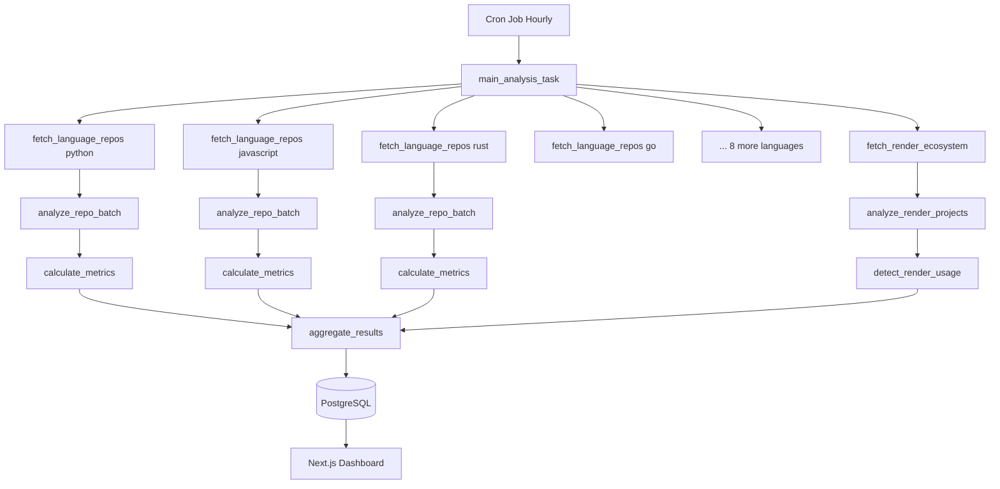

# Trender: GitHub Trending Analytics Platform

## Project Overview

A batch analytics platform that analyzes trending GitHub repositories across multiple programming languages, leveraging Render Workflows' distributed task execution to process data in parallel. Runs hourly via cron to update trending metrics and specially highlights Render's open-source ecosystem.

**Key Value Propositions:**

- **For Developers**: Discover emerging tools before they hit mainstream
- **For Render Workflows**: Showcase parallel execution, sub-second spin-up, retries, and API integration patterns
- **For Render Marketing**: Built-in spotlight on Render OSS projects, employee work, and community success stories

## Architecture



## Tech Stack

**Backend (Workflows)**

- Python 3.11+
- Render Workflows SDK
- GitHub API (REST)
- PostgreSQL client (asyncpg)
- aiohttp for async API calls

**Frontend (Dashboard)**

- Next.js 14 (App Router)
- TypeScript
- Tailwind CSS
- Recharts for visualizations
- PostgreSQL connection (pg)

**Infrastructure**

- Render Workflows (task execution)
- Render Cron Job (hourly trigger)
- Render Web Service (Next.js dashboard)
- Render PostgreSQL (data storage)

## Implementation Phases

### Phase 1: Database and Schema Setup

Create PostgreSQL database with 5 core tables:

**1. `trending_repos`** - Main repository data with metrics and Render flags

```sql
CREATE TABLE trending_repos (
  id SERIAL PRIMARY KEY,
  repo_full_name VARCHAR(255) UNIQUE NOT NULL,
  repo_url TEXT NOT NULL,
  language VARCHAR(50) NOT NULL,
  stars INTEGER NOT NULL,
  star_velocity DECIMAL(5,2),
  activity_score DECIMAL(5,2),
  momentum_score DECIMAL(5,2),
  commits_last_7_days INTEGER,
  issues_closed_last_7_days INTEGER,
  active_contributors INTEGER,
  description TEXT,
  uses_render BOOLEAN DEFAULT FALSE,
  render_category VARCHAR(50),
  render_services TEXT[],
  has_blueprint_button BOOLEAN DEFAULT FALSE,
  render_complexity_score INTEGER,
  created_at TIMESTAMP NOT NULL,
  last_updated TIMESTAMP NOT NULL DEFAULT NOW()
);
```

**2. `trending_snapshots`** - Historical tracking for trend analysis

**3. `language_rankings`** - Per-language top repos over time

**4. `render_showcase`** - Curated Render project highlights

**5. `workflow_execution_stats`** - Performance metrics for showcasing Render Workflows

### Phase 2: GitHub API Integration Layer

Create Python module `github_api.py` with:

- Authentication via GitHub Personal Access Token (5000 req/hour)
- Rate limit handling with exponential backoff
- Helper functions:
  - `search_repositories(language, filters)`
  - `get_repo_details(owner, repo)`
  - `get_commits(owner, repo, since)`
  - `get_issues(owner, repo, state, since)`
  - `get_contributors(owner, repo)`
  - `get_file_contents(owner, repo, path)`
  - `search_by_topic(topic)`
  - `search_readme_mentions(keyword)`

Key implementation detail for rate limiting:

```python
def github_api_call(url: str, headers: dict) -> dict:
    response = requests.get(url, headers=headers)
    remaining = int(response.headers.get('X-RateLimit-Remaining', 0))
    if remaining < 100:
        reset_time = int(response.headers.get('X-RateLimit-Reset', 0))
        sleep_duration = max(reset_time - time.time(), 0)
        time.sleep(sleep_duration + 5)
    response.raise_for_status()
    return response.json()
```

### Phase 3: Render Workflows Task Implementation

Create `workflow.py` with 8 interconnected tasks:

**Task 1: `main_analysis_task()`** (Orchestrator)

- Define 12 target languages
- Spawn language tasks + Render ecosystem task in parallel using `asyncio.gather()`
- Aggregate results and store execution metrics

**Task 2: `fetch_language_repos(language: str)`**

- Search GitHub API: `/search/repositories?q=language:{language}&sort=stars`
- Filter for repos updated in last 30 days
- Return batch of top 100 repos
- Retry config: 3 retries, 60s backoff

**Task 3: `analyze_repo_batch(repos: List[Dict])`**

- Process 10 repos at a time
- Fetch detailed metrics: commits, issues, contributors
- Check for render.yaml and README badges
- Skip failed repos, continue with batch
- Retry config: 2 retries, 45s backoff

**Task 4: `fetch_render_ecosystem()`**

- Fetch from `render-examples` and `render` orgs
- Search topics: `render`, `render-deploy`, `render-blueprints`
- Search README mentions of "render.com"
- Check curated list of Render employee GitHub profiles
- Retry config: 3 retries, 60s backoff

**Task 5: `analyze_render_projects(render_repos: List[Dict])`**

- Standard metrics + Render-specific scoring
- Blueprint quality: parse render.yaml for service diversity
- Documentation score: deploy button, README quality
- Categorize: official, employee, community, blueprint
- Retry config: 2 retries, 30s backoff

**Task 6: `detect_render_usage(repo_data: Dict)`**

- Parse render.yaml to extract services, databases, build commands
- Scan Dockerfile for Render patterns
- Check for Render environment variables
- Calculate complexity score (0-10)
- Retry config: 1 retry

**Task 7: `calculate_metrics(enriched_repos: List[Dict])`**

- Star velocity: `(stars_last_7_days / total_stars) * 100`
- Activity score: weighted formula using commits, issues, contributors
- Momentum score: `(star_velocity * 0.4) + (activity_score * 0.6)`
- Apply Render boost multiplier for marketing visibility
- Freshness penalty for repos older than 180 days
- Retry config: 1 retry

**Task 8: `aggregate_results(all_language_results, render_results)`**

- Flatten and merge all results
- Deduplicate across language and Render datasets
- Sort by momentum score
- Take top 100 overall, top 20 per language, top 50 Render showcase
- Write to all 5 database tables
- Retry config: 3 retries, 30s backoff

**Task 9: `store_execution_stats(duration, metrics)`** (bonus)

- Record workflow performance data
- Calculate parallel speedup vs sequential
- Track retry success rates
- Store in `workflow_execution_stats` table

### Phase 4: Cron Trigger Service

Create `trigger.py` for Render Cron Job:

- Runs hourly: `0 * * * *`
- Triggers workflow via Render API
- Logs execution status
- Handles trigger failures gracefully

Environment variables:

- `RENDER_WORKFLOW_ID`
- `RENDER_API_KEY`

### Phase 5: Next.js Dashboard Frontend

Create Next.js 14 app with 6 main pages:

**Page 1: Home `/`**

- Hero with latest workflow stats (repos analyzed, last run time, speedup)
- Render Spotlight banner (rotating 3 featured projects)
- Filters: language, time range (24h/7d/30d), "Show only Render projects"
- Top 100 repos as cards with metrics
- Render badge for projects using Render
- "Last updated" indicator with next run countdown

**Page 2: Render Showcase `/render`**

- Hero: "Built with Render"
- 4 featured categories:
  - Official Blueprints (top 10)
  - Community Stars (top 15)
  - Employee Innovation (top 10)
  - Workflow Showcase (this project as meta-example)
- Ecosystem stats dashboard (total projects, stars, deployment stats)

**Page 3: Language Deep Dive `/language/[lang]`**

- Language header with stats
- Render projects in this language (separate section)
- Time-series charts: star growth, activity scores, commit heatmap
- Sortable table of top 50 repos
- Pie chart: Render service adoption in this language

**Page 4: Repository Detail `/repo/[owner]/[name]`**

- Overview card with all metrics
- If uses Render: special section showing services, render.yaml link, deploy button, auto-generated architecture diagram
- Historical momentum chart (last 30 snapshots)
- "Why it's trending" insights box
- Comparison vs similar projects

**Page 5: Workflow Performance Dashboard `/meta`**

- Latest execution visualization (task tree, status indicators)
- Performance metrics box (duration, speedup, success rate, task count)
- Historical charts: execution time trends, success rate, task distribution
- Task breakdown table with individual stats
- Code snippet showcase with annotations

**Page 6: Marketing Assets `/for-marketing`**

- Featured project cards (exportable as images)
- Auto-generated success stories
- Verified workflow performance claims
- Customer highlights for outreach
- Blueprint spotlight with usage stats
- Export options: CSV, images, embeddable widgets

### Phase 6: Render Configuration

Create `render.yaml` defining all services:

```yaml
services:
  - type: web
    name: trender-dashboard
    runtime: node
    buildCommand: npm install && npm run build
    startCommand: npm start
    envVars:
      - key: DATABASE_URL
        fromDatabase:
          name: trender-db
          property: connectionString
      - key: NEXT_PUBLIC_API_URL
        value: https://trender-dashboard.onrender.com

  - type: cron
    name: trender-analyzer-cron
    runtime: python
    schedule: "0 * * * *"
    buildCommand: pip install -r requirements.txt
    startCommand: python trigger.py
    envVars:
      - key: RENDER_WORKFLOW_ID
        sync: false
      - key: RENDER_API_KEY
        sync: false

databases:
  - name: trender-db
    databaseName: trender
    plan: standard
```

Separate workflow deployment via Render Workflows CLI/API.

### Phase 7: Marketing Integration Features

Add optional tasks for marketing automation:

**`generate_marketing_assets()`**

- Identify top 5 Render community projects weekly
- Generate social media card images
- Store for marketing dashboard access

**`create_monthly_blog_draft()`**

- Compile monthly statistics
- Format top projects and ecosystem growth
- Generate markdown blog post draft

**`identify_success_stories()`**

- Find projects meeting case study criteria (500+ stars, 50% growth, uses Render)
- Enrich with contact info
- Store leads for outreach

**`analyze_deployment_platforms()`**

- Compare Render adoption vs competitors (Vercel, Railway, Fly)
- Generate competitive intelligence report

**`track_blueprint_metrics()`**

- Monitor blueprint usage, deploys, time-to-deploy
- Flag underperforming blueprints

### Phase 8: Testing and Optimization

- Test GitHub API rate limit handling
- Verify parallel task execution (12 languages simultaneously)
- Validate Render detection logic (render.yaml parsing)
- Test retry mechanisms with simulated failures
- Optimize database queries for dashboard performance
- Test all frontend pages with mock and live data
- Verify calculation formulas (momentum score, Render boost)

## Key Implementation Notes

**Batch Processing Emphasis:**

- Hourly execution via cron, not continuous
- Results update periodically, shown as "Last updated X minutes ago"
- Next run countdown indicator on dashboard
- Historical snapshots for trend analysis

**Render Workflows Showcase:**

- Track and display execution metrics (speedup, task count, retry success)
- Visualize parallel task execution
- Demonstrate fault tolerance (continue if one language fails)
- Show sub-second task spin-up times

**Render Ecosystem Focus:**

- Separate showcase page for Render projects
- Boost multiplier for Render projects in ranking
- Special badges and "Deploy to Render" buttons
- Architecture visualizations from render.yaml

**Scalability Considerations:**

- Start with 12 languages, easily expandable to 50+
- Batch size of 10 repos per `analyze_repo_batch` task
- Rate limit buffer of 100 requests before throttling
- Database indexes on language, momentum_score, uses_render

## Success Metrics

**Technical:**

- Process 1,200+ repos in under 15 seconds
- 8-10x speedup vs sequential processing
- 99%+ success rate on workflow runs
- Sub-second task spin-up times

**Marketing:**

- Showcase 50+ Render ecosystem projects
- Auto-generate weekly social media content
- Identify 5+ case study candidates per month
- Track competitive platform adoption trends

## Repository Structure

```
trender/
├── workflows/
│   ├── workflow.py           # Main workflow tasks
│   ├── github_api.py         # GitHub API integration
│   ├── metrics.py            # Calculation logic
│   ├── render_detection.py  # Render usage detection
│   └── requirements.txt
├── trigger/
│   ├── trigger.py            # Cron trigger script
│   └── requirements.txt
├── dashboard/
│   ├── app/
│   │   ├── page.tsx          # Home
│   │   ├── render/page.tsx
│   │   ├── language/[lang]/page.tsx
│   │   ├── repo/[owner]/[name]/page.tsx
│   │   ├── meta/page.tsx
│   │   └── for-marketing/page.tsx
│   ├── components/
│   ├── lib/
│   │   └── db.ts             # PostgreSQL connection
│   ├── package.json
│   └── tailwind.config.js
├── database/
│   └── schema.sql            # Database initialization
├── render.yaml               # Render configuration
└── README.md
```

## Deployment Steps

1. Create Render PostgreSQL database
2. Run schema.sql to initialize tables
3. Deploy Render Workflows with workflow.py
4. Create Render Cron Job with trigger.py
5. Deploy Next.js dashboard as Render Web Service
6. Configure environment variables
7. Trigger first manual workflow run
8. Verify dashboard displays results
9. Enable hourly cron schedule

